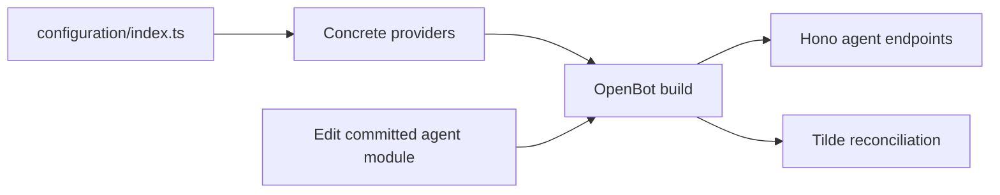

# ADR-0001: Fork-owned repository configuration

## In brief

- Fork owns one `configuration/` tree: agent-scoped resources, provider composition, and provider plugins.
- `configuration/index.ts` explicitly constructs every selected provider.
- Agent entrypoints read runtime environment directly; no second provider composition module.
- Agent entrypoints integrate external SDKs directly and never import provider packages.
- Core owns contracts and lifecycle. No layer system.
- Agents are authored directly in the fork. Runtime never generates or publishes source.

## Context

OpenBot must be simple to fork and customize while keeping upstream core changes reusable. Scattered imports or a layer-merging model would obscure ownership and make upgrades harder.

## Decision

`openbot init` creates `configuration/index.ts` inside the one fork-owned `configuration/` tree. The entrypoint calls `Configuration({ providers: { ... } })` with concrete provider instances grouped by domain as `controlService`, `agentService`, `chat`, `agent`, `computer`, `skills`, and `tools`. Provider packages export implementations but no string-to-provider selector factories; changing an implementation is an explicit source change in the fork composition root.

Repository content is always discovered from canonical paths: the primary agent from `configuration/agent/`, subagents from `configuration/agent/subagents/<id>/`, skills and workspace seeds inside each owning agent, and custom provider source from `configuration/providers/`. The primary keeps the stable ID `hello-world`; subagent IDs come from their directory names. Global `configuration/skills/` and `configuration/sandbox/` directories are unsupported. These paths and the `/api/agents` route prefix are conventions, not `OpenBotConfiguration` options.

Agent directories use the Eve-compatible subset recorded in ADR-0011. Their `agent.ts` default-exports a Tilde `chatKitEndpoint` request handler, while `instructions.ts`, instrumentation, libraries, authored tools, authored skills, and sandbox workspace seeds remain colocated with the agent. OpenBot does not define a second execution SDK or use Eve's loader. Build-time discovery federates these endpoints; deployment registers agent workspaces without overwriting existing persistent files.

Provider composition configures OpenBot's control, provisioning, and deployment machinery; it is not an agent dependency-injection container. Authored agents instantiate their model, MCP, skill, Composio, or other vendor clients directly. `configuration/templates/agent/` owns those defaults for newly scaffolded agents.

OpenBot stores only reconciliation mappings, digests, and leases as Control State. Tilde remains authoritative for registered agents, skills, conversations, tools, and memory; credentials remain in `EnvProvider`.

## Consequences

- Fork changes remain ordinary reviewable source and survive upstream updates.
- Provider selection is statically visible and type-checked without descriptors or runtime string factories.
- New provider kinds require stable interfaces; agent changes wait for review and deployment.

## Updates

- 2026-08-13T11:12:53+02:00: Moved provider selection into generated `configuration/index.ts` with explicit concrete construction and removed descriptor-driven selector factories.
- 2026-08-13T11:20:28+02:00: Grouped concrete implementations under `providers` and made agents, skills, custom provider source, and sandbox resources use fixed file-based conventions instead of configurable paths.
- 2026-08-13T12:27:55+02:00: Replaced flat agent modules with path-identified agent directories modeled on Eve while retaining OpenBot's ChatKit runtime and shared-computer boundary.
- 2026-08-13T13:23:44+02:00: Removed installation-level skill and sandbox configuration; skills and workspace seeds now exist only inside their owning agent directory.
- 2026-08-13T16:00:30+02:00: Reduced the repository's initial `configuration/` tree to `.gitkeep`; every fork must run `openbot init` to materialize its composition root, encrypted configuration, instrumentation, and first agent.
- 2026-08-13T16:21:00+02:00: Prohibited root environment and SOPS configuration. Fork values load only from `configuration/`; contributor and CI values come from the process environment and never become fork defaults.
- 2026-08-13T16:27:00+02:00: Kept all seven roles explicit in `configuration/index.ts` while moving the five agent-runtime instances to `configuration/runtime-providers.ts`, preventing service build/deploy tooling from entering agent artifacts.
- 2026-08-13T17:13:43+02:00: Replaced the upstream `.gitkeep` with an ignore-all `configuration/.gitignore`; successful init removes only that exact sentinel so upstream contributions stay configuration-free while forks commit their generated configuration and preserve the deletion across normal merges.
- 2026-08-14T10:18:00+02:00: Consolidated all provider construction in `configuration/index.ts`, removed `configuration/runtime-providers.ts`, and kept generated agent entrypoints independent by reading their runtime environment directly.
- 2026-08-14T10:28:18+02:00: Limited provider composition to OpenBot control and lifecycle concerns; authored agents now integrate external SDKs directly and keep future defaults in the agent template.
- 2026-08-14T15:27:17+02:00: Established one full primary agent at `configuration/agent/` and equally capable full agents under `configuration/agent/subagents/<id>/`.
