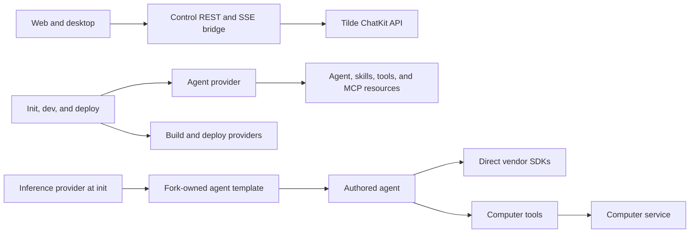

# ADR-0004: Narrow domain provider packages

## In brief

- Providers serve control APIs, initialization/provisioning, and build/deploy lifecycles.
- Tilde conversation data is consumed through its native REST/SSE API.
- One agent provider reconciles the complete external footprint of each authored agent.
- Inference providers may seed SDK-specific source into the default agent template at init.
- Authored agents import SDKs directly, never provider packages.
- Remove unused provider methods. No universal provider SDK.

## Context

OpenBot originally grouped chat data, external resource provisioning, model selection, prompt injection, tools, skills, and Computer operations behind broad provider contracts. That made providers look like a generic agent plugin system and forced authored agents through abstractions designed for OpenBot's control plane.

The web and desktop need access to Tilde-owned conversation state without duplicating Tilde's contract. Startup and deployment need typed external-resource lifecycles. Authored agents need freedom to use whichever SDKs and services fit their job.

## Decision

A provider operation is valid only when it is consumed by one of these boundaries:

- control service data or mutation handling for the web or desktop;
- initialization questions or startup provisioning;
- external resource reconciliation required before services start;
- `check`, `build`, `plan`, `configure`, or `deploy` lifecycles.

Provider contracts live in `src/core.ts` or `src/core/` in the owning domain package. Adapters live beside them. Contracts contain only operations used by those boundaries; speculative and convenience methods are removed.

Tilde owns conversation-facing agent, session, message, attachment, queue, and streaming contracts. OpenBot does not project those operations through a Chat Provider or control RPC. The browser uses an allowlisted same-origin REST/SSE bridge that preserves Tilde's request and response shapes while the server supplies team credentials.

`agent-provider` exposes one idempotent deployment lifecycle for the complete external footprint of an authored agent. Its Tilde adapter owns endpoint lookup, creation, repair, status reconciliation, authored-skill synchronization, exact skill-registry membership, dynamic MCP reconciliation, Tilde control-plane tools, and deployment-platform MCP integrations. These are cohesive internal reconcilers, not separately configurable Skills or Tools Providers. The CLI schedules the aggregate lifecycle once per agent and never contains vendor CRUD.

The old model-facing inference-model provider is removed. A narrow `inference-provider` may own initialization, external credential provisioning, credential readiness checks, provider-owned files that seed the default agent template, and provider-specific runtime files required by a deployment artifact. It exposes no request-time model factory. The CLI copies the selected contribution into `configuration/templates/agent/` during initialization; from then on it is fork-owned source. Authored agents import the selected AI SDK provider directly through that generated source. A deployment build may consume named `agent-service.target` and `agent-service.artifact` handoffs from the agent-service build, as the Codex provider does when it adds the native Linux executable to prebuilt Vercel functions.

Code under `configuration/agent/`, including its `subagents/`, must not import provider packages or `configuration/index.ts`. Agents instantiate model clients, MCP clients, skill clients, Composio, and other SDKs directly. Defaults for future agents live in `configuration/templates/agent/`; existing agents change only through explicit edits.

The standard typed Computer AI tools are a reusable runtime utility in `@tryopenbot/computer-tools`, separate from `computer-service-provider`. They call the capability-protected Computer service. `computer-service-provider` retains only provisioning and lifecycle methods in its public contract, while concrete adapters may use internal Computer operations to implement those lifecycles. The provider package does not depend on or re-export `computer-tools`.

Shared vendor plumbing used across domains belongs in `platform-integrations`. Multiple adapters share one concrete platform instance so initialization runs once. Domain mapping and error translation remain in each adapter.

## Consequences

- Control-plane abstractions stay small and testable.
- Agent developers are not blocked by generic provider contracts.
- Adding an agent integration usually changes agent code and its template, not provider interfaces.
- Selecting an inference provider seeds its runtime adapter into future-agent source without coupling agents to control-plane packages.
- Provider-owned native runtime files can be added during the build lifecycle without exposing a model factory to authored agents.
- Shared vendor initialization remains deduplicated without coupling domain providers.
- Removing a provider operation is expected when no allowed consumer remains.
- Skills and tools cannot be selected independently from the Tilde agent lifecycle.

## Updates

- 2026-09-02T12:45:00+02:00: Kept hosted-inference metering outside the
  inference provider. Provider initialization only classifies managed project
  OIDC versus direct-key/subscription inference; the authored agent composes
  the public SDK billing controller with its durable AgentRun effect ledger.
  Every Gateway call reserves because BYOK may fall back to charged system
  credentials and fallback cannot be disabled. The authoritative generation
  receipt releases BYOK reservations; zero-credit organizations cannot start a
  Gateway call. A planned, uncertain, or reconciled inference effect without a
  recoverable model response terminally fails its AgentRun; automatic replay is
  forbidden and a later owner request starts a new run.
- 2026-08-29T14:55:00Z: Made the Agent Provider omit memory from new bundle
  requests. Tilde memory banks are paid, opt-in resources; agent creation must
  not enroll or fail on them implicitly. Bundle omission preserves an existing
  agent-owned bank, so users can enable memory explicitly without OpenBot
  deleting it on later reconciliation.
- 2026-08-25T12:35:12+02:00: Replaced client-side agent/MCP/registry choreography with Tilde's durable Agent Resource Bundle API. OpenBot still authors runtime source and reconciles ChatKit realtime plus credential-bearing platform integrations, while Tilde owns the canonical MCP server, skill registry, default memory bank, bindings, credential rotation, and deletion cleanup.
- 2026-08-25T19:41:00+02:00: Made Tilde's stable machine-user profile the canonical agent identity. The Agent Provider renders and uploads a deterministic PNG avatar after bundle convergence; display-name and avatar updates no longer depend on device-local onboarding state.
- 2026-08-25T20:12:00+02:00: The owner-facing agent-creation route establishes the initial bundle with the deployment API key delegated by the signed-in human. Later machine-only deploys reconcile the same bundle without replacing that individual lifecycle owner.

- 2026-08-21T13:50:00+01:00: Allowed inference providers to contribute initialization-time agent template files and credential readiness checks while preserving direct vendor SDK imports and prohibiting request-time model factories on provider contracts.
- 2026-08-21T14:15:00+01:00: Allowed an inference provider build to consume the agent-service artifact handoff and add provider-owned native runtime files for Vercel deployment.
- 2026-08-14T15:36:00+02:00: Added a provisioning-only inference-provider boundary for Vercel AI Gateway credentials while preserving direct AI SDK imports in authored agents.
- 2026-08-13T11:12:53+02:00: Removed universal provider packages plus default descriptor, health, verification, and selector-factory requirements in favor of explicit domain interfaces and composition.
- 2026-08-13T12:09:51+02:00: Removed the unused legacy `contracts` package after control and computer callers moved to their domain service protos.
- 2026-08-13T12:53:05+02:00: Folded every `*-provider-core` package into its owning provider package while preserving a visible core contract boundary.
- 2026-08-13T13:17:11+02:00: Renamed `computer-providers` to singular `computer-provider`.
- 2026-08-14T10:28:18+02:00: Split chat operations from agent provisioning, removed inference and model-facing provider hooks, moved Computer AI tools to a non-provider package, and prohibited provider imports from authored agents.
- 2026-08-14T10:55:00+02:00: Replaced public agent-resource CRUD with an idempotent `Deployable`; the Tilde adapter now discovers desired agents, reconciles Vercel AI SDK endpoints for development and production, and clears an endpoint before removing a stale managed agent.
- 2026-08-14T18:40:00+02:00: Removed the Tilde state file from OpenBot's normal lifecycle. Tilde providers now reconcile agents, authored skills, exact registries, dynamic MCP servers, the Tilde control-plane toolkit, and deployment-platform MCP integrations directly through typed APIs. Operators may still use the Tilde CLI manually for one-time team-to-team state migration.
- 2026-08-16T15:08:39+02:00: Removed Chat, Skills, and Tools Provider packages. Tilde conversation traffic now retains its native REST/SSE contract, while one Agent Provider lifecycle reconciles each authored agent and all of its external skills, tools, and MCP resources.
- 2026-08-17T20:05:00+02:00: Renamed `@tryopenbot/computer-provider` to `@tryopenbot/computer-service-provider` and removed its `computer-tools` compatibility export and dependency so service lifecycle and agent runtime tools remain separate package boundaries.
- 2026-08-25T12:00:00+02:00: Kept one Agent Provider lifecycle while moving its dependent Tilde reconciliation sequence behind one typed, idempotent bundle operation at the Tilde composition root.
