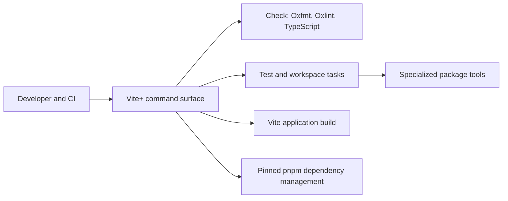

# ADR-0004: Unified Vite+ toolchain

## In brief

- Choose Vite+ for repository tooling. Keep one command surface and stable script meanings.
- pnpm stays package manager behind Vite+. No direct task orchestration.
- Split Node and browser compiler and bundle presets. Node packages do not inherit DOM globals.
- Emit external production source maps without embedding source content.
- Generated, vendored, and agent-skill files stay outside formatter ownership. Never create review noise without product value.
- Cost: Vite+ installation and migration lock-in. Accepted.

## Context

OpenBot previously split development tasks across pnpm scripts, Turbo, Vite, Vitest, TypeScript, and package-specific lint aliases. That made `lint` mean type-checking in most packages, provided no repository formatter, and required multiple orchestration paths in local development, CI, deployment, and packaging.

The repository needs one documented command surface that can run consistently across its workspace while retaining package-specific artifact tools such as tsdown/Rolldown, native Go TypeScript (`tsgo`), and protobuf generation.

## Decision

Vite+ is OpenBot's repository-wide toolchain entry point. `vp check` owns Oxfmt formatting, Oxlint linting, and type-aware TypeScript checks. `vp test`, `vp build`, and `vp run` own test, Vite application build, and workspace task execution. Vite+ delegates dependency management to the pinned pnpm version.

Package scripts have stable meanings: `lint` runs `vp lint`, `typecheck` runs `tsc --noEmit`, and `check` runs `vp check`. The native `tsgo` compiler remains an explicitly named artifact check where ADR-0008 requires it; it is not a lint alias.

The root `vite.config.ts` is authoritative for shared lint and format policy. Package scripts retain specialized implementation commands when Vite+ does not replace them, including tsdown/Rolldown builds, protobuf generation, Electron packaging, and Playwright. Generated contracts, generated manifests, vendored Beautiful UI files, runtime agent skills, and Markdown are excluded from automatic formatting where reformatting would obscure ownership or provenance.

Shared TypeScript configuration is split into Node and browser presets. Node packages receive Node types and the ECMAScript library without global DOM types. Browser packages receive DOM libraries without global Node types. Shared tsdown configuration follows the same boundary through `tsdown.node.config.ts` and `tsdown.browser.config.ts`. Production bundles emit external source maps and exclude embedded source content.

Turbo is removed. Local development scripts, deployment validation, Vercel commands, Git hooks, editor settings, and GitHub Actions use the `vp` command surface.

## Consequences

- Contributors use one command vocabulary locally and in automation.
- A package's `lint`, `typecheck`, and `check` scripts are predictable and cannot silently substitute for one another.
- Runtime boundaries are compiler-visible: accidental browser API use in Node packages and accidental Node-global use in browser packages fail type-checking.
- External source maps improve production stack traces without copying authored source into map files.
- New lint and formatter policy belongs in the root Vite+ configuration.
- Vite+ upgrades must preserve the pinned Vite/Vitest workspace overrides and pass the complete OpenBot validation pipeline.

## Updates

- 2026-08-14T15:03:00+02:00: Replaced stale tsup and package-specific lint guidance with tsdown, stable script meanings, environment-specific compiler and bundle presets, and external production source maps.
