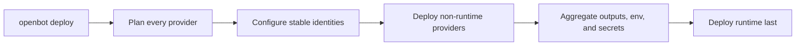

# ADR-0006: Provider deployment lifecycle

## In brief

- One `openbot deploy` plans, optionally configures, then deploys opted-in providers.
- Providers without an exposed `deployable` are skipped entirely.
- `configure()` is optional. Use it only for stable identity or prerequisites.
- Each configured provider deploys independently, even when two use the same vendor.
- Non-runtime providers deploy first. Runtime deploys last with their environment and secrets.
- Deployment values stay in memory and secret values are never reported.

## Context

OpenBot can use the same vendor through several domain providers. For example, separate provider implementations might both use Vercel. Automatically collapsing those implementations into one vendor deployment would couple otherwise independent domains and require an infrastructure ownership model that the application does not yet have.

There is also an ordering cycle: a provider such as Tilde can need the runtime's stable public origin before it deploys, while the runtime needs the secrets and environment variables produced by Tilde before it releases application code.

## Decision

`runtime-provider` defines a `Deployable` lifecycle with required `plan()` and `deploy()` methods and an optional `configure()` method. Domain provider packages import this contract and let a provider expose it through an optional `deployable` property. A provider without that property is not a deployment participant and is skipped without lifecycle events.

`plan()` is read-only and is the only lifecycle method called during a dry run. `configure()` may establish stable identities or remote prerequisites that downstream providers require, but it is not required for providers that can deploy directly. Both `configure()` and `deploy()` may return named outputs, secrets, and environment variables.

The coordinator plans every registered participant, configures participants that implement `configure()`, deploys every non-runtime participant in registration order, then deploys the single runtime participant last. The runtime receives the aggregate environment variables and secrets and installs them using its native mechanism before starting or releasing the application. Conflicting values fail rather than using last-write-wins behavior. Events include names and counts only, never secret values.

Two providers that happen to use Vercel remain two independent deployment participants and reimplement their own lifecycle for now. The coordinator does not deduplicate them by vendor or deployment ID. Shared vendor infrastructure can be extracted later when there is a concrete shared resource and ownership boundary.

The selected computer provider is a non-runtime participant. Its build phase
creates and content-tags the shared computer image. A remote provider such as
Vercel Sandbox pushes that image during deploy; the local Microsandbox provider
keeps the image in Docker and contributes its local reference. Existing computers
are intentionally not updated in preview or production because their image and
persistent workspace belong to their creation lifecycle. Development is the
exception: Vercel Sandbox delegates to Microsandbox, and a changed local image
replaces the running Computer while retaining its ID and named workspace volume.

Every hook receives the required `DeploymentContext.devMode`. Development runs
checks, lets Tilde reconcile external resources, and makes service deployables
no-op because one watched Hono process owns control and agent routes. Deployment
environment selection remains separate from this lifecycle-mode flag.

The local runtime implementation writes a private runtime environment file, then installs OpenBot as a user service: systemd on Linux or launchd on macOS. Service definitions contain only the environment-file path, not secret values.

Do not adopt a general infrastructure state engine yet. Alchemy has a useful resource/output/reconciliation model, but without built-in Vercel and Tilde resources OpenBot would still need custom providers plus another state lifecycle.

## Consequences

- Operators invoke one deployment command and do not manually sequence providers.
- Stable runtime identity breaks the dependency cycle without deploying the runtime twice.
- Providers that do not need configuration omit `configure()`.
- Using one vendor in multiple provider domains can repeat vendor-specific work until an explicit shared abstraction is justified.
- Tilde deployment remains a later participant; the current implementations are Vercel and local runtime deployment.

## Updates

- 2026-08-13T11:12:53+02:00: Added computer providers as non-runtime build and deployment participants that publish content-tagged image references without mutating existing computers.
- 2026-08-13T12:53:05+02:00: Renamed the lifecycle package to `runtime-provider` as part of eliminating separate core packages; lifecycle semantics are unchanged.
- 2026-08-13T17:53:21+02:00: Split computer image delivery by provider: Vercel Sandbox uses Buildx and publishes to Vercel Container Registry, while local Microsandbox derives a local Docker tag from the Git remote and does not ask for or push to a registry.
- 2026-08-13T18:34:00+02:00: Made the Vercel image repository provider-owned: service configuration creates both Vercel projects before deploy, then the computer provider derives the agent project's VCR namespace and creates its repository on the first authenticated push instead of asking during init.
- 2026-08-14T17:18:21+02:00: Added mandatory `devMode` to every lifecycle hook, skipped Vercel remote work in development, delegated Vercel Sandbox development to Microsandbox, and added watched local image replacement.
