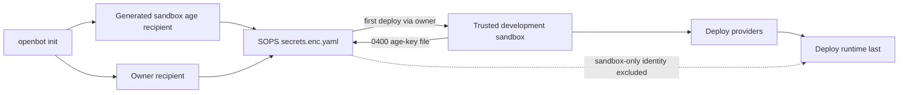

# ADR-0007: SOPS bootstrap and provider initialization

## In brief

- Choose age for sandbox automation. No PGP bootstrap.
- Two SOPS recipients, one group. Sandbox age or owner identity decrypts.
- Owner prefers Vault or cloud KMS. 1Password and native keychain remain local fallbacks.
- Sandbox private identity lives encrypted at `SECRETS_SOPS_AGE_KEY.value`.
- First deploy uses owner authority. Trusted development sandbox receives a private age-key file.
- Provider questions stay declarative. Ink and browser renderers own presentation.
- Shared platform setup runs once; domain providers retain only role-specific questions.
- The trusted development sandbox receives all fork environment and encrypted secrets.
- Ordinary agent Computers still receive neither the SOPS identity nor deployment authority.

## Context

OpenBot must be able to run and mutate its complete development setup inside a sandbox, then deploy providers and the final runtime. That sandbox needs deployment credentials and a durable way to decrypt repository secrets after its first creation. Encrypting its private identity only to itself would create a bootstrap cycle, while giving every agent computer the identity would collapse the control and computer trust boundaries.

Provider setup also needs interactive input, but provider packages must not depend on Ink because the same onboarding will later be renderable in the web application.

## Decision

`openbot init` creates `configuration/.env` first, then generates an X25519 age identity dedicated to the trusted development sandbox. Age is smaller and easier to automate safely than a generated PGP identity. The owner selects a second independent recipient: HashiCorp Vault Transit, Azure Key Vault, Google Cloud KMS, AWS KMS, a generated age identity stored in 1Password, or a generated age identity stored in the operating system keychain.

Both recipients occupy the same SOPS key group, so either can decrypt. Threshold key groups are not used. Every top-level secret is a `{ description, value }` mapping; `encrypted_regex: ^value$` keeps descriptions readable while encrypting values. The sandbox private identity is stored only inside `configuration/secrets.enc.yaml` at `SECRETS_SOPS_AGE_KEY.value`. On deployment, the owner recipient decrypts that value and the computer provider writes it to `/workspace/.openbot/development/sops-age-key.txt` with mode `0400` inside a mode-`0700` directory.

The trusted development sandbox is a deployment controller and secret-bearing boundary. Every deployment refreshes `configuration/.env`, `configuration/.sops.yaml`, and `configuration/secrets.enc.yaml` in its source tree. Its `.bashrc` and `.bash_profile` source an idempotent loader that sources dotenv values, points SOPS at the private age-key file, decrypts the top-level described secrets, and exports their values. There are no lifecycle secret groups or separate sandbox environment result fields. Ordinary OpenBot Computers created for agents never receive the SOPS identity or the fork configuration files.

Providers may expose serializable initialization metadata: label, description, questions, validation, choices, and a destination mapping to either `.env` or encrypted secrets. Providers do not expose terminal components or browser components. The CLI renders that schema with Ink; a later browser flow can render the same schema.

When several domain providers use the same external platform, they reference one concrete `Platform` implementation by stable ID. The initializer collects its initialization contract once and rejects conflicting definitions. `TildePlatform` owns one shared connection and lazily cached Harness SDK client, plus shared request, cancellation, and error-normalization helpers used by its agent, skills, and tools adapters. `VercelPlatform` owns the shared credential and account scope plus common project, environment, deployment-output, and registry operations used by its control-service, agent-service, and computer adapters. Domain providers continue to own role-specific inputs, entity mapping, domain error translation, and artifact behavior. Destination-key deduplication remains a final collision check rather than the ownership mechanism.

After the initial bootstrap, running `openbot init` inside the configured repository is a reconciliation operation. It loads the active provider graph, decrypts current described secrets, pre-populates each platform and provider question from its destination, and updates only the destinations represented by that graph. Unknown environment and secret entries remain intact. The existing SOPS creation rule and owner metadata remain authoritative, and `vp install` runs after reconciliation. Changing SOPS recipients is an explicit owner maintenance operation, not an init prompt.

Plaintext sent to SOPS stays in memory. The CLI uses a private named pipe for SOPS versions that require an input filename; the FIFO contains no stored file data. Generated owner age identities are passed to 1Password or native keychain commands over standard input, never command arguments.

Owner identity lookup metadata is machine- and user-specific. It lives in `~/.openbot/config.json` under `sops`, not in the repository. An explicitly selected AWS profile is stored there rather than as SOPS `aws_profile` configuration. Before every owner-side SOPS operation, the CLI asks AWS CLI to refresh and export that profile's temporary credentials, then passes them to SOPS only through the child-process environment. This avoids SOPS selecting an expired cached IAM Identity Center session while preserving the profile choice across init, decrypt, and secret mutation. Interactive commands recover missing lookup metadata without replacing existing recipients; non-interactive commands fail with an actionable instruction instead of guessing.

## Consequences

- Loss of the sandbox does not lose owner access to repository secrets.
- Compromise of the trusted sandbox exposes this installation's secrets and deployment authority; use a unique age identity per installation.
- Changing recipients remains an owner maintenance operation using `sops updatekeys` and, after compromise, `sops rotate`.
- 1Password secret references, AWS profiles, and native-keychain metadata are non-secret but user-specific; keep them in `~/.openbot/config.json`, never the fork.
- The computer provider owns trusted sandbox creation, configuration refresh, Bash-profile loading, and user-only age-key installation.

## Updates

- 2026-08-14T15:14:30+02:00: Removed lifecycle secret grouping for the trusted development sandbox. Deployment now refreshes the fork `.env`, SOPS config, and encrypted secrets, writes the age identity as a `0400` user-owned file, and loads dotenv plus decrypted SOPS values from Bash profiles.
- 2026-08-14T10:27:59+02:00: Moved user-specific SOPS owner lookup metadata from the fork into typed `~/.openbot/config.json` state, added interactive recovery, and made non-interactive commands fail instead of guessing missing identity configuration.
- 2026-08-14T00:21:24+02:00: Replaced metadata-only initialization dependencies with concrete `Platform` implementations, moved common Tilde and Vercel operations out of domain providers, and made init re-runnable with stored prompt defaults, config reconciliation, existing SOPS ownership, and dependency installation preserved.
- 2026-08-13T23:59:56+02:00: Added stable shared platform initialization dependencies so Tilde and Vercel setup is collected once across their domain providers while role-specific questions remain with the consuming provider.
- 2026-08-13T23:34:00+02:00: Replaced grouped secret mappings with mandatory described top-level entries, encrypted only `value`, adopted concise repository-facing built-in names, and added described `openbot env set|unset` management for plaintext configuration.

- 2026-08-13T12:53:05+02:00: Implemented the trusted development sandbox as a sandbox-role deployment participant that seeds repository source once, installs the aggregate deployment environment with mode `0600`, verifies SOPS decryption, and remains separate from ordinary agent workspaces.
- 2026-08-13T14:49:44+02:00: Added a SOPS-generated static computer-service API key shared only with control, agent, and computer runtimes; computer RPC authorization validates that exact bearer key, and model-controlled Linux processes start with a clean allowlisted environment that excludes it.
- 2026-08-13T18:10:37+02:00: Routed selected AWS profiles through AWS CLI credential refresh and ephemeral SOPS process environments instead of SOPS `aws_profile`, which could select an expired cached SSO session.
