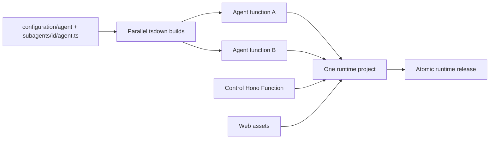

# ADR-0008: One runtime deployment with isolated agent functions

## In brief

- Build and deploy one runtime artifact containing control, web, and agent entrypoints.
- One Vercel project owns the whole OpenBot runtime.
- Every agent source becomes its own Vercel Function entrypoint.
- Agent functions remain isolated at execution, but deploy and roll back atomically with control and web.
- Local production and development each use one Hono process.
- Software-producing providers implement `Buildable.check()` and `Buildable.build()` as well as `Deployable`.
- `openbot deploy` always checks and builds selected services first. `--skip-deploy` stops after artifacts exist.
- Use native Go TypeScript (`tsgo`) for artifact checks and tsdown/Rolldown for bundles. Vite+ owns repository orchestration and validation.

## Context

Agent implementations change more frequently than the owner-facing control API and web application. The original decision optimized that difference with separate control and agent projects, but it also duplicated project identity, environment reconciliation, deployment coordination, and local service supervision. Tilde now exposes enough unified control-plane operations that OpenBot no longer benefits from retaining a second service boundary merely to coordinate those resources.

OpenBot also needs equivalent local production behavior without making development operate multiple unnecessary processes. Build tooling is part of this boundary: the old tsup pipeline is deprecated, and JavaScript TypeScript checking is too slow for a directory of independently bundled agents.

## Decision

`agent-service-provider` owns the consolidated runtime implementation. It composes the existing control/web builder with discovery of the primary `configuration/agent/agent.ts` and every `configuration/agent/subagents/<id>/agent.ts`. Configuration supplies the same runtime provider instance as both `controlService` and `agentService`; identity, not merely provider class, is the signal that deployment is consolidated. The legacy provider packages remain compatibility building blocks for installations that still compose split services.

Vercel receives one prebuilt Build Output API artifact. Its project contains static web assets, the control Hono Function, and one `.func` per authored agent. Changed agent builds execute concurrently through tsdown's Rolldown/Oxc pipeline; content digests reuse unchanged function directories and conservatively invalidate on shared package or lockfile changes. One deployment publishes the complete runtime, while the agent endpoints retain independent function execution, scaling, bundles, and logs.

Local builds emit one Node artifact that mounts agent routes before the control/web fallback. Deployment installs `openbot-control` as the sole user service on port 4100. After that service passes its health check and Tilde endpoint cutover succeeds, deployment disables and preserves a legacy `openbot-agents` service definition as a recoverable `.retired` file. Repeated deployments converge without repeating retirement.

During development both local and Vercel service deployables stop after their
checks and leave startup to that watched process. The Computer image has a
separate provider-owned watch loop because changing a container base image
requires rebuilding and replacing Microsandbox rather than restarting Hono.

The deploy coordinator runs selected `check()` and `build()` methods before provider deployment. In consolidated mode, `--service all`, `--service agents`, and `--service control` all expand to the complete runtime and its prerequisites because a partial release would create a deployment that does not match its artifact. Split installations retain the legacy service filtering behavior. `--skip-deploy` remains a safe build-only exit.

Native `@typescript/native-preview` is deliberately limited to artifact checks while it remains a preview. tsdown replaces tsup for server bundles and supplies direct programmatic, concurrent builds over Rolldown. Vite+ owns the repository command surface and delegates dependency installation to pnpm; the provider build implementations continue to call the artifact tools that match their output.

## Consequences

- Function execution, scaling, bundles, and logs are separated per agent.
- Control, web, and agent changes share one project identity, environment, release, and rollback boundary.
- Shared agent-project environment variables are not a hard per-agent secret boundary.
- A shared dependency change can rebuild every affected agent.
- Per-agent rollback requires a future project-per-agent mode and is intentionally excluded.
- Existing consumers may continue reading `agent-service.deployment-url`; consolidated providers publish it as an alias of the runtime deployment URL.

## Updates

- 2026-08-13T12:27:55+02:00: Made each directory-owned `agent.ts` the independent build entrypoint and included the full authored agent tree in invalidation.
- 2026-08-13T16:09:00+02:00: Reconciled this artifact decision with ADR-0004: Vite+ replaces Turbo for orchestration while `tsgo` and tsdown/Rolldown remain the service artifact compiler path.
- 2026-08-13T16:27:00+02:00: Split agent-runtime provider construction from the full composition module so independently bundled agent entrypoints cannot retain control/agent deployment compilers or their native bindings.
- 2026-08-14T17:18:21+02:00: Made development run provider checks without service artifact deployment, retained one control/agent HMR process, and added a separate watched Microsandbox image rebuild/restart loop.
- 2026-08-16T15:08:39+02:00: Routed `/api/*` to the deployed control Function so the same Tilde REST/SSE bridge is available in Vercel, local production, development, and packaged desktop runs; removed the obsolete owner `/rpc` route.
- 2026-08-19T10:00:00Z: The ADR-0004 referenced in the 2026-08-13 entry above is the Vite+ toolchain record, which has since been renumbered to ADR-0026. ADR-0004 now unambiguously means narrow domain provider packages.
- 2026-08-26T16:18:13+01:00: Reversed the split deployment decision after Tilde gained unified control-plane operations. Control, web, and isolated agent Functions now ship as one runtime project and one local service, with compatibility retained for explicitly split installations.
- 2026-08-26T17:00:00+01:00: Deferred retirement of the legacy local agent service until after the healthy combined runtime becomes Tilde's authoritative endpoint, preserving automatic rollback on failed cutover.
