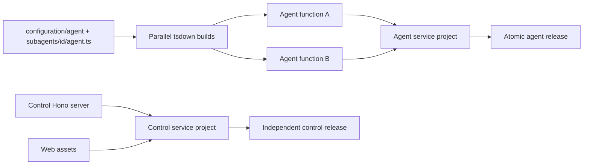

# ADR-0008: Split control and agent service artifacts

## In brief

- Build and deploy control and agent services independently.
- One Vercel project owns control plus web; another owns all agent functions.
- Every agent source becomes its own Vercel Function entrypoint.
- Agent functions build concurrently, but deploy and roll back atomically as one agent-service release.
- Local production uses separate user services and ports. Development uses one Hono process.
- Software-producing providers implement `Buildable.check()` and `Buildable.build()` as well as `Deployable`.
- `openbot deploy` always checks and builds selected services first. `--skip-deploy` stops after artifacts exist.
- Use native Go TypeScript (`tsgo`) for artifact checks and tsdown/Rolldown for bundles. Vite+ owns repository orchestration and validation.

## Context

Agent implementations change more frequently than the owner-facing control API and web application. A single server artifact makes every agent edit rebuild and redeploy control, while one Vercel project per agent creates project, environment, domain, rollback, and cleanup overhead.

OpenBot also needs equivalent local production behavior without making development operate multiple unnecessary processes. Build tooling is part of this boundary: the old tsup pipeline is deprecated, and JavaScript TypeScript checking is too slow for a directory of independently bundled agents.

## Decision

`control-service-provider` owns the control server and web artifact. `agent-service-provider` discovers the primary `configuration/agent/agent.ts` and every `configuration/agent/subagents/<id>/agent.ts`, validates each authored TypeScript tree with the native TypeScript compiler, and emits an independent bundle for each agent. Both packages implement `Buildable` and `Deployable` for local and Vercel targets.

Vercel receives prebuilt Build Output API artifacts. The control project contains its Hono function and static web assets. The agent project contains one `.func` per agent plus its health function. Changed agent builds execute concurrently through tsdown's Rolldown/Oxc pipeline; content digests reuse unchanged function directories and conservatively invalidate on shared package or lockfile changes. A single agent-service deployment publishes the complete function set, so endpoints are isolated at execution but deployment and rollback remain atomic.

Local builds emit two Node artifacts. Deployment installs `openbot-control` and `openbot-agents` user services through systemd on Linux or launchd on macOS. Control defaults to port 4100 and agents to 4101. `openbot dev` mounts agent routes before the control/web fallback in one watched Hono server on port 4100.

During development both local and Vercel service deployables stop after their
checks and leave startup to that watched process. The Computer image has a
separate provider-owned watch loop because changing a container base image
requires rebuilding and replacing Microsandbox rather than restarting Hono.

The deploy coordinator runs all selected `check()` and `build()` methods before any provider deploy lifecycle. Build outputs feed planning and deployment. `--service agents` avoids control compilation and deployment; `--service control` does the inverse. `--skip-deploy` is a safe build-only exit. Providers without `Buildable` remain deployable, and providers without `Deployable` remain buildable.

Native `@typescript/native-preview` is deliberately limited to artifact checks while it remains a preview. tsdown replaces tsup for server bundles and supplies direct programmatic, concurrent builds over Rolldown. Vite+ owns the repository command surface and delegates dependency installation to pnpm; the provider build implementations continue to call the artifact tools that match their output.

## Consequences

- Agent edits do not rebuild or redeploy control.
- Function execution, scaling, bundles, and logs are separated per agent.
- Shared agent-project environment variables are not a hard per-agent secret boundary.
- A shared dependency change can rebuild every affected agent.
- Per-agent rollback requires a future project-per-agent mode and is intentionally excluded.
- Concrete Tilde endpoint registration can consume `agent-service.deployment-url`; it is not coupled to control deployment.

## Updates

- 2026-08-13T12:27:55+02:00: Made each directory-owned `agent.ts` the independent build entrypoint and included the full authored agent tree in invalidation.
- 2026-08-13T16:09:00+02:00: Reconciled this artifact decision with ADR-0004: Vite+ replaces Turbo for orchestration while `tsgo` and tsdown/Rolldown remain the service artifact compiler path.
- 2026-08-13T16:27:00+02:00: Split agent-runtime provider construction from the full composition module so independently bundled agent entrypoints cannot retain control/agent deployment compilers or their native bindings.
- 2026-08-14T17:18:21+02:00: Made development run provider checks without service artifact deployment, retained one control/agent HMR process, and added a separate watched Microsandbox image rebuild/restart loop.
- 2026-08-16T15:08:39+02:00: Routed `/api/*` to the deployed control Function so the same Tilde REST/SSE bridge is available in Vercel, local production, development, and packaged desktop runs; removed the obsolete owner `/rpc` route.
