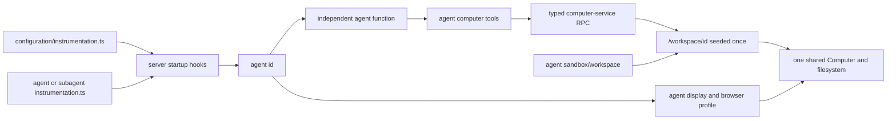

# ADR-0011: Eve-compatible agent layout

> Agent-specific desktop sessions on the shared Computer were refined by ADR-0015.

## In brief

- Primary agent is `configuration/agent/`; full subagents are `configuration/agent/subagents/<id>/`.
- Keep Eve-shaped authored slots where useful. No Eve runtime or loader.
- `agent.ts` default-exports `chatKitEndpoint`. `instructions.ts` feeds its system prompt.
- One shared computer, filesystem, and process identity. Each agent gets a desktop session; each populated seed gets `/workspace/<id>`.
- Seed workspace once. Never overwrite deployed agent files implicitly.
- Keep Eve's authored `sandbox/` folder and familiar tool names; use computer terminology elsewhere.
- Scaffold explicit typed Computer tools whose shared implementations live in the non-provider `computer-tools` package.
- Agent runtime code imports SDKs directly and never imports provider packages.
- Fork-owned `configuration/templates/agent/` defines future agent scaffolds.
- Default agent tool loop stops at 50 steps. No unbounded model/tool cycle.

## Context

OpenBot needs a predictable, portable authored-agent layout without inventing vocabulary that already exists in Vercel's Eve SDK. Eve's filesystem model is a useful convention, but OpenBot uses Tilde ChatKit endpoints, its own provider composition, one shared computer, and independently built local or Vercel agent-service artifacts. Blind Eve compatibility would therefore promise runtime behavior OpenBot does not have.

## Decision

The primary agent lives at `configuration/agent/` and keeps the stable ID `factory`. Additional agents live at `configuration/agent/subagents/<id>/`; their directory names are their IDs. Both use the same complete authored subset. Subagents may not contain another `subagents/` directory.

```text
configuration/
├── instrumentation.ts
├── templates/agent/**/*.hbs
└── agent/
    ├── agent.ts
    ├── instructions.ts
    ├── instrumentation.ts
    ├── lib/
    ├── tools/
    ├── skills/
    ├── sandbox/workspace/**
    └── subagents/<id>/
        ├── agent.ts
        ├── instructions.ts
        ├── instrumentation.ts
        ├── lib/
        ├── tools/
        ├── skills/
        └── sandbox/workspace/**
```

`agent.ts` is required and default-exports the request handler returned by Tilde `chatKitEndpoint(...)`. `instructions.ts` is required, default-exports the system instructions, and is imported explicitly by `agent.ts`. OpenBot does not support `instructions.md`.

Init seeds `configuration/templates/agent/` from packaged defaults only when the
directory is missing. `openbot new-agent` recursively renders that fork-owned
template, preserves relative paths, and removes `.hbs` suffixes. Template edits
affect future agents only; existing authored agents are never regenerated
implicitly. Provider-composition changes may therefore require both a template
update and an explicit migration of existing agents.

The optional instrumentation files use Eve's `defineInstrumentation({ setup })` authoring shape from `@tryopenbot/configuration/instrumentation`. `configuration/instrumentation.ts` runs first for every agent at server startup; an optional agent-local `instrumentation.ts` runs second; only then does OpenBot import `agent.ts`. OpenBot supplies the resolved path-derived `agentName`. Instrumentation is a server startup hook, not an agent tool.

Every file under `tools/` default-exports a Vercel AI SDK tool. Every skill is a spec-conformant Markdown file or skill package. `lib/` is ordinary import-only TypeScript. Skills remain authored structure without automatic loading. Tools are explicitly imported by `agent.ts`; OpenBot does not use a directory loader. Channels, connections, hooks, schedules, and nested subagents are not supported.

OpenBot terminology calls the runtime a Computer, so new APIs, environment variables, and provider contracts use `computer`. The authored `sandbox/workspace/**` path and familiar model-facing tool names are deliberate compatibility exceptions that keep OpenBot agent repositories structurally familiar without changing the shared-computer model.

Every agent explicitly contains `await_shell.ts`, `bash.ts`, `copy_from_computer.ts`, `copy_to_computer.ts`, `read_file.ts`, `write_file.ts`, `glob.ts`, `grep.ts`, and `screenshot.ts`. Each file is a thin default export from `@tryopenbot/computer-tools` with the path-derived agent ID fixed outside its model-visible schema. This non-provider utility owns the reusable Vercel AI SDK tools and Zod schemas; computer-service-proto remains transport-only. Agent code does not call Microsandbox, Vercel Sandbox, or an untyped HTTP endpoint directly. The API-key-protected computer-service validates the request and uses the fixed agent ID to select `/workspace/<id>` as the default directory and to scope durable background-job handles.

Authored agents do not import any provider package or the fork's provider composition. They instantiate model, MCP, skill, Composio, and other vendor clients directly. The fork-owned template carries direct-integration defaults to future agents without turning providers into an agent plugin API.

The provider-owned default inference template bounds each model/tool run at 50 steps. Forks may
replace that policy in authored code, but the upstream default never permits an unbounded loop;
request cancellation remains available for earlier termination.

Bash tools invoke `bash -lc` with `HOME=/workspace/<id>`, making the agent's
directory the login-shell home. Init scaffolds `sandbox/workspace/.profile` so
every Bash command has one deterministic startup file; that profile may source
an optional `.bashrc`. The profile contains no secrets and follows the same
one-time seed semantics as every other authored workspace file.

OpenBot does not reproduce Eve's one-sandbox-per-agent model. One OpenBot Computer, filesystem, and service process identity are shared by all agents. Computer-service gives each agent its own virtual display and persistent browser profile inside that Computer so concurrent desktop work does not collide visually. When an agent has authored workspace seed files, deployment creates `/workspace/<id>` and copies them there. Commands and relative file paths default to that directory, while absolute paths can address the wider machine. Agent IDs provide routing context, not filesystem, process, or desktop isolation: agents can inspect or modify sibling directories and administer the shared machine subject to the computer process's operating-system privileges.

Files from either agent form's `sandbox/workspace/**` are copied only when the populated agent directory is first seeded. Empty seed trees do not create `/workspace/<id>`. Ordinary later agent deployments detect the marker and leave the persistent directory untouched. Consequently, edits to authored workspace seeds do not appear for already deployed agents; applying them requires a future explicit workspace reconciliation or destructive computer replacement operation.

Agent-service discovery, checking, content digests, local federation, and parallel Vercel function builds use `agent.ts` inside each directory as the entrypoint. OpenBot follows Eve's layout where possible, but it does not load these folders with Eve and does not claim behavioral compatibility.



## Consequences

- Fork authors get a familiar Eve-shaped tree without coupling OpenBot deployment to Eve.
- Each agent remains an independently compiled function entrypoint.
- Required computer tools are explicit; arbitrary tools and skills remain author-controlled.
- Persistent agent workspaces are protected from silent seed overwrites.
- Compute, process identity, and filesystem access are installation-wide; agent desktops and `/workspace/<id>` are routing conventions, not security boundaries.
- The Eve-compatible authored folder and default tools retain Eve names; runtime and API language says `computer`.
- Fork owners can change future agent defaults without modifying the CLI package.

## Updates

- 2026-08-21T13:50:00+01:00: The selected inference provider may seed provider-owned files into the default agent template during initialization; the copied files immediately become fork-owned and existing agents still change only through explicit edits.
- 2026-08-26T14:02:03+01:00: Set the provider-owned default and this fork's authored agents to a
  50-step model/tool safety cap instead of allowing unbounded tool cycles.
- 2026-08-13T12:53:05+02:00: Strengthened agent filesystem isolation from path translation alone to a private bind-mounted `/workspace` plus Linux-user execution.
- 2026-08-13T14:29:49+02:00: Kept `sandbox/workspace` solely for Eve layout compatibility, required one typed computer tool file per supported operation, and moved agent-to-user execution enforcement into computer-service.
- 2026-08-13T14:49:44+02:00: Standardized required scaffolding on Eve's `bash`, `read_file`, `write_file`, `glob`, and `grep`; each tool fixes its agent ID outside model input and routes through computer-service.
- 2026-08-13T15:19:48+02:00: Standardized agent Bash commands on login-shell startup and scaffolded a one-time workspace `.profile` that may source `.bashrc`.
- 2026-08-13T15:36:39+02:00: Made `openbot new-agent` the canonical agent scaffolder, reused it from init, centralized standard tool implementations in computer-provider, and removed the redundant hello-world tool.
- 2026-08-13T15:41:25+02:00: Replaced per-agent Linux users and mount namespaces with one shared filesystem; populated seeds now initialize `/workspace/<agent-id>` and commands default there without treating it as a security boundary.
- 2026-08-13T16:42:00+02:00: Added explicit copy-to, copy-from, screenshot, background-shell, and await-shell scaffolding with Zod schemas; background job state now survives computer-service restarts on the Computer's persistent disk.
- 2026-08-13T17:33:29+02:00: Renamed authored agent imports from the private `@openbot` workspace scope to `@tryopenbot`; the Eve-compatible filesystem layout and `openbot` CLI remain unchanged.
- 2026-08-14T03:15:00+02:00: Kept `new-agent` filesystem-only and made `dev` reconcile each authored agent's Tilde ChatKit endpoint, MCP server, and skill registry before server startup. Non-secret resource IDs live in `configuration/.env`; endpoint credentials remain in encrypted configuration, and generated agents select their own MCP server and registry through those per-agent variables.
- 2026-08-14T10:03:00+02:00: Made `configuration/templates/agent/` the fork-owned source for future agents. Init seeds it without overwriting owner edits; `new-agent` renders it recursively, while existing agents remain unchanged.
- 2026-08-14T10:28:18+02:00: Moved reusable Computer AI tools to `@tryopenbot/computer-tools`, instrumentation helpers to `@tryopenbot/configuration/instrumentation`, and prohibited provider imports from authored agents; agent integrations now use their vendor SDKs directly.
- 2026-08-14T10:55:00+02:00: Made `new-agent` invoke the same idempotent development lifecycle as `dev` after filesystem scaffolding; the Tilde agent provider, rather than the CLI, owns endpoint reconciliation and local tunneling.
- 2026-08-14T15:27:17+02:00: Made `configuration/agent/` the full primary agent and `configuration/agent/subagents/<id>/` the canonical home for equally complete additional agents. Discovery and builds reject deeper nesting.
- 2026-08-15T13:25:19+02:00: Added one persistent virtual display and browser profile per agent inside the shared Computer; display routing does not add sandbox or operating-system isolation.
- 2026-08-18T16:30:00Z: Renamed the primary agent from `hello-world` to `factory`, deleted the hello-world template assets, and gave every scaffolded subagent a `self-edit` skill. Recorded retroactively; PR 57 amended this record's prose without an entry.
