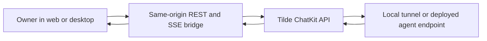

# ADR-0014: Owner chat through a Tilde REST and SSE bridge

## In brief

- Web and desktop preserve Tilde ChatKit's native REST and SSE contracts.
- The control service exposes an allowlisted same-origin bridge and injects server credentials.
- No Chat Provider or owner-facing protobuf contract is retained.
- Agent execution remains behind the independently deployed agent endpoint.

## Context

Tilde owns agents, ChatKit sessions, messages, and agent execution, while OpenBot owns the
owner-facing workspace. The original reset shell had no chat transport, so a running or deployed
installation could provision an agent without letting its owner converse with it.

## Decision

The browser calls same-origin `/api/chat/*` routes using Tilde's resource shapes directly. Hono maps only the ChatKit team subtree, the configured organization/team root attachment subtree, and validated signed attachment uploads. It forwards raw request bodies and response streams, removes browser-supplied credentials and hop-by-hop headers, injects the configured Tilde credentials, disables caching, and preserves upstream status codes and content types.

The bridge does not accept tenant overrides and cannot proxy arbitrary Tilde control-plane APIs. Tilde remains authoritative for agents, sessions, messages, attachments, queues, events, and interruption. OpenBot keeps no duplicate conversation contract or state. Local Vite, packaged desktop, local production, and the Vercel control Function all route the same `/api/*` surface to Hono.

Agent responses still execute through the Agent Provider-managed endpoint, whether that endpoint is a development tunnel or the deployed agent service.

## Consequences

- Conversation state remains authoritative in the Tilde Team.
- Control deployments route `/api/*` to the Hono Function and keep credentials server-side.
- Tilde status codes, JSON bodies, attachment bytes, and SSE frames cross without an OpenBot projection layer.
- The bridge is intentionally Tilde-specific; a second chat backend requires a new product decision rather than a generic provider contract in advance.

## Updates

- 2026-08-16T15:08:39+02:00: Replaced the initial ConnectRPC and Chat Provider projection with the allowlisted Tilde REST/SSE bridge, removed `control-service-proto`, and made the browser's existing ChatKit client the sole owner-chat contract.
