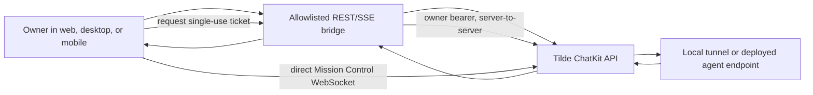

# ADR-0014: Owner chat through Tilde REST and direct Mission Control WebSockets

## In brief

- Web, desktop, and mobile preserve Tilde ChatKit's native REST, SSE, and WebSocket contracts.
- The control service exposes an allowlisted same-origin bridge and injects server credentials.
- Team-wide background activity connects directly to Tilde with a single-use socket ticket.
- No Chat Provider or owner-facing protobuf contract is retained.
- Agent execution remains behind the independently deployed agent endpoint.

## Context

Tilde owns agents, ChatKit sessions, messages, and agent execution, while OpenBot owns the
owner-facing workspace. The original reset shell had no chat transport, so a running or deployed
installation could provision an agent without letting its owner converse with it.

## Decision

OpenBot clients call `/api/chat/*` using Tilde's resource shapes directly. Web and packaged desktop use the same-origin route; mobile uses the installation's absolute HTTPS origin. Hono maps only the ChatKit team subtree, the configured organization/team root attachment subtree, and validated signed attachment uploads. It forwards raw request bodies and response streams, removes browser-supplied credentials and hop-by-hop headers, injects the configured Tilde credentials, disables caching, and preserves upstream status codes and content types.

The bridge does not accept tenant overrides and cannot proxy arbitrary Tilde control-plane APIs. Tilde remains authoritative for agents, sessions, messages, attachments, queues, events, and interruption. OpenBot keeps no duplicate conversation contract or state. Local Vite, packaged desktop, local production, and the Vercel control Function all route the same `/api/*` surface to Hono.

Agent responses still execute through the Agent Provider-managed endpoint, whether that endpoint is a development tunnel or the deployed agent service.

OpenBot also needs owner-visible activity for agents whose conversations are not currently open. The
client runtime obtains a short-lived, single-use Mission Control ticket from the authenticated control
service, then connects directly to Tilde's documented WebSocket. The exchange forwards the current
owner bearer token server-to-server; browser JavaScript never receives it. Web and Electron request a
browser ticket bound to the installation registration, organization, team, scope, current membership,
WebSocket audience, and exact registered HTTP Origin. Expo explicitly requests a native ticket using
its protected bearer; native issuance requires bearer authentication and redemption requires an
Origin-free socket. The ticket travels as a WebSocket subprotocol credential and is atomically consumed.

Tilde publishes the Mission Control WebSocket contract as AsyncAPI generated from the same Rust event
types used at runtime. The team-scoped socket is one system channel rather than one channel per chat:
every connected owner client needs background activity for all accessible conversations. AsyncAPI
separates client ping, server control frames, and typed domain events into distinct operations while
retaining the single physical channel. The direct socket forwards the client's last applied durable
revision as `after_revision`, so a reconnect replays events produced while the client was offline.
The framework-neutral client runtime owns heartbeat, revision cursors, capped exponential reconnect
backoff with jitter, and event parsing. Tilde sends a ready barrier with the current revision; OpenBot
refreshes authoritative sidebar and selected-session state before advancing that cursor, closing the
initial REST-to-WebSocket race. Event cursors advance only after client reconciliation succeeds.

## Consequences

- Conversation state remains authoritative in the Tilde Team.
- Control deployments route `/api/*` to the Hono Function and keep credentials server-side.
- Tilde status codes, JSON bodies, attachment bytes, and SSE frames cross without an OpenBot projection layer.
- The bridge is intentionally Tilde-specific; a second chat backend requires a new product decision rather than a generic provider contract in advance.
- The control service no longer holds one upstream WebSocket per browser; its retained role is the
  owner-authorized ticket exchange and the existing REST/SSE compatibility bridge.
- The client-owned Mission Control dependency is checked against Tilde's generated AsyncAPI contract.
- Ticket persistence adds a deliberately narrow replay-prevention record in Tilde.

## Updates

- 2026-08-16T15:08:39+02:00: Replaced the initial ConnectRPC and Chat Provider projection with the allowlisted Tilde REST/SSE bridge, removed `control-service-proto`, and made the browser's existing ChatKit client the sole owner-chat contract.
- 2026-08-17T18:00:00+02:00: Added mobile as an owner client and moved parsing, transport, and live-state reconciliation into a shared framework-neutral client runtime without introducing a second server contract.
- 2026-08-21T12:00:00+01:00: Added the server-side Mission Control WebSocket to background SSE adapter for team-wide agent activity, with the undocumented dependency isolated behind one allowlisted control-service boundary.
- 2026-08-25T12:00:00+02:00: Replaced the undocumented event dependency with Tilde's Rust-derived AsyncAPI contract, retained one team-wide physical channel, and adopted durable event revisions plus aggregate REST snapshots for reconnect convergence.
- 2026-08-26T16:18:13+01:00: Replaced the background SSE adapter with a direct client-to-Tilde Mission Control WebSocket using single-use browser/Electron Origin-bound or Expo native-bearer tickets, a ready barrier, and revision-safe reconnects.
