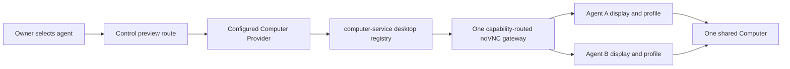

# ADR-0015: Agent desktop sessions on one Computer

## In brief

- One Computer. Many agent desktops. No extra sandbox.
- Computer-service owns displays, browser profiles, VNC routing.
- Control service exposes preview only. No provider API in renderer.
- Agent ID routes work. No security boundary.

## Context

Owners need to watch and take over the Computer used by a selected agent. A single shared display makes simultaneous agents overwrite each other's pointer, browser, and visible state. One sandbox per agent would prevent that interference but would break OpenBot's deliberate shared-Computer model and multiply image, filesystem, and lifecycle cost.

The renderer also cannot receive provider lifecycle, process, file, raw endpoint, or service-credential authority merely to show a desktop.

## Decision

OpenBot keeps one shared Computer. Computer-service maintains an idempotent desktop registry below `/workspace/.openbot/desktops/` and allocates one X display and browser profile per agent. All sessions still share the same sandbox, operating-system identity, filesystem, network, and computer-service process. An agent ID selects a display; it does not isolate the agent.

One noVNC gateway serves the Computer. The Computer Provider derives an agent-scoped capability and asks computer-service to reconcile its mapping to the selected display. Repeated workspace deployment, preview, screenshot, input, and wake calls converge on the same display and profile.

The control service exposes only `GET /api/computer/:agentId/preview`. It resolves the configured Computer Provider server-side and redirects the iframe to the short-lived capability URL. The web and Electron renderers receive no Computer lifecycle, file, process, input, provider-selection, or service-credential API. Interactive input remains inside the capability-scoped noVNC client and requires an explicit owner take-over action in the UI.

## Consequences

- Agents can keep independent visible desktops while sharing files and processes.
- Browser profiles persist with the shared Computer and are not an authorization boundary.
- The browser gets a narrow preview surface, not a generic Computer SDK.
- Every active agent desktop consumes memory inside the same Computer.
