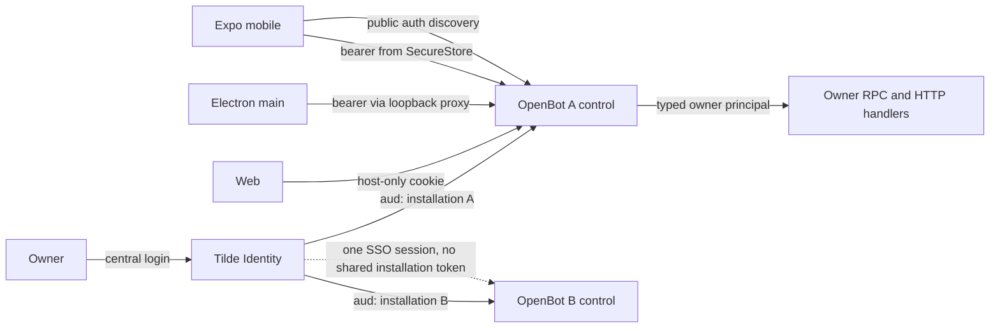

# ADR-0016: Tilde OIDC and installation-scoped owner access

## In brief

- Tilde Identity default authority. OpenBot installation stays OIDC client and resource server. No per-installation identity provider.
- One installation, one resource identifier, one access-token audience. Scope says allowed action, never installation identity.
- Web gets host-only HttpOnly cookies. Electron main and mobile get native PKCE credentials. UI gets no token.
- Central Tilde login gives multi-installation SSO. Installation cookies and access tokens never cross installations.
- Owner middleware guards owner surfaces. Tilde callbacks, agent endpoints, and Computer credentials stay separate.
- Cost: Tilde dependency and bounded token-revocation delay. Accepted; BYO OIDC remains possible.

## Context

OpenBot serves the same owner workspace from a local control service, a Vercel control deployment,
and an Electron shell. The control service currently has no owner authentication or control
database, even though its chat, attachment, and Computer-preview operations can expose sensitive
installation data and capabilities.

A clean-room review of another desktop agent established only behavioral requirements: use the
system browser for sign-in, keep credentials in the Electron main process, expose bounded account
state to the renderer, and bind durable installation data to an authorized account. No source,
identifiers, or prose from that product are reused. The public `trytilde/agent` implementation also
demonstrates deployment registration, Authorization Code with PKCE, cookie and bearer transports,
and audience-restricted JWT verification.

OAuth audience and scope are not interchangeable. The audience identifies where a token may be
redeemed; scope describes what access is granted there. OAuth Resource Indicators explicitly warn
against overloading scope with resource identity and define a standard mechanism for selecting an
audience-restricted token. Sharing one cookie or one broad token among OpenBot installations would
enlarge the replay and revocation boundary.

Better Auth remains useful as an application session framework, but deploying an identity authority
inside every OpenBot installation would duplicate accounts and make every installation responsible
for issuer keys, discovery, consent, client registration, and recovery. Its OIDC Provider plugin is
also documented as active development, with incomplete JWKS support and planned replacement by its
OAuth Provider plugin. It is not the default trust anchor.

## Decision

Tilde Identity is OpenBot's default OAuth authorization server and OpenID Provider. An OpenBot
installation is registered to a Tilde Team during onboarding, and any current team member may
authorize it. Registration assigns a stable installation ID, an issuer-assigned resource URI, and
OAuth client metadata for the installation's supported web and native redirects. The client is
public and has no client secret. The existing team-scoped Tilde API key used during registration
remains in `configuration/secrets.enc.yaml`; public identifiers and issuer metadata live in
`configuration/.env`.

The OAuth client and protected resource remain distinct concepts:

- `client_id` identifies the web or Electron OAuth client.
- Registration binds the public client to exactly one installation resource. Tilde derives the
  access-token audience from that server-owned binding rather than accepting a client-selected
  resource. A future client that legitimately targets multiple resources can use RFC 8707 resource
  indicators without changing the audience/scope model.
- The access token `aud` identifies only that installation resource. The control service rejects a
  token without its exact configured audience, even when every other claim is valid.
- `scope` describes operations meaningful to that resource, such as reading workspace state,
  operating agents, or administering the installation. Installation IDs are never encoded as scope
  names.
- Subject membership, owner role, and other installation entitlements use subject, role, group, or
  entitlement claims and server-side authorization policy. Possessing a generic OpenBot scope is
  not proof that the subject owns this installation.

Tilde's own login cookie provides SSO at the authorization-server origin. Opening another OpenBot
installation starts a new PKCE authorization flow for that installation resource; an existing Tilde
session can complete it without prompting the Owner again. Each installation still receives its own
audience-restricted access token and host-only session cookies. OpenBot does not issue a default
multi-audience token and never shares an installation cookie across origins.

Browser clients use Authorization Code with PKCE. The control-service callback exchanges the code
server-side and sets a short-lived access cookie plus a refresh cookie. Cookies are host-only,
HttpOnly, Secure outside loopback development, and SameSite. Browser JavaScript never receives either
token. A protected ticket-exchange route may redeem the authenticated access token server-to-server
for a short-lived, audience- and Origin-bound capability such as one Mission Control WebSocket;
that capability cannot be refreshed or reused as an owner bearer. Cookie-authenticated unsafe requests additionally require a matching Origin; OAuth callbacks
require one-time state and PKCE verification.

Electron uses the system browser and a registered native redirect. The Electron main process owns
the PKCE verifier, callback, refresh lifecycle, and operating-system-protected token storage. Its
existing loopback renderer proxy attaches the access token as an Authorization bearer when calling
the control service. The preload bridge exposes only bounded authentication state and sign-in or
sign-out commands. The renderer never receives tokens or an unrestricted auth client. OpenBot does
not rely on the external browser and Electron sharing a cookie jar.

Expo mobile uses the same public-client Authorization Code with PKCE flow and a registered app-scheme
redirect. It opens the system browser, keeps refresh and access tokens in operating-system-protected
SecureStore, refreshes before authenticated requests, and supplies only an access-token callback to
the framework-neutral client runtime. Tokens never enter Zustand state, React component props, logs,
or AsyncStorage. Mobile and Electron may share server-side OAuth client registration only when that
registration explicitly allowlists both native redirects.

Mobile selects the installation before authentication. The Owner enters a control-service origin;
the app verifies its public OpenBot health response and reads the provider-owned public client ID,
scope, authorization endpoint, and token endpoint from `/auth/native-config`. This route has no
credentials, tenant overrides, tokens, issuer signing material, or authorization decision. Hosted
origins and OAuth endpoints require HTTPS. The selected origin and token record are associated, and
changing origin clears the old installation's native credentials.

The control service installs owner-authentication middleware before every owner-facing RPC and HTTP
surface, including chat proxying, attachments, and Computer preview. It accepts an Authorization
bearer before falling back to the access cookie, verifies signature and time claims, and requires the
configured issuer, installation audience, authorized client, token purpose, subject, installation
link, and route scope. It then supplies a typed owner principal to handlers and provider calls.
Static application assets, health, public native-auth discovery, and the narrowly bounded login,
callback, session-refresh, and logout routes are the only public control surfaces. Installation registration belongs to the Tilde
team API and is never exposed by the OpenBot control service.

Owner authentication does not replace other trust boundaries. Signed Tilde callbacks and tools,
agent-service endpoints, Computer-service requests, deployment credentials, and future user-desktop
device credentials retain their own verification and cannot be exchanged for owner authority.

Disabling or deleting a registration must prevent new authorization and refresh grants when a
registration-revocation operation is introduced. The initial implementation has no unlink API.
Logout clears the local cookies or Electron credentials and revokes upstream refresh authority when
supported. Already issued access tokens remain valid only for their short lifetime; expired tokens
fail closed when the issuer is unavailable. Immediate per-request revocation would require
introspection or OpenBot control persistence and is intentionally not introduced by this decision.

Alternative OIDC issuers may implement the same contract. They must support discovery, Authorization
Code with PKCE, installation-specific resource audiences, required JWT validation claims, and the
configured web and native redirects. The audience may be fixed by a one-resource client registration
or selected with RFC 8707 when a client can address multiple resources. Operators may supply client
registration manually when the issuer does not support dynamic registration. Better Auth may back
such a centralized issuer or a future session adapter, but OpenBot does not deploy its OIDC Provider
plugin per installation.

## Consequences

- A token stolen from one installation cannot be replayed against another installation by changing
  a URL or presenting a generic scope.
- Owners can move among installations with Tilde SSO while each installation retains an independent
  cookie, audience, authorization decision, and revocation boundary.
- Web, Electron, and mobile share one server authorization policy without forcing native
  credentials into renderer or component state.
- The installation registration lifecycle must reconcile issuer metadata, resource identity,
  redirect URIs, and encrypted client secrets where applicable.
- Middleware and provider contracts must carry a typed owner principal rather than treating
  successful authentication as sufficient authorization.
- The initial implementation can validate short-lived JWTs without adding a control database.
  Durable opaque sessions, immediate revocation, or multi-owner policy would be separate persistence
  decisions.

## References

- [OAuth 2.0 Resource Indicators, RFC 8707](https://www.rfc-editor.org/rfc/rfc8707)
- [JWT Profile for OAuth 2.0 Access Tokens, RFC 9068](https://www.rfc-editor.org/rfc/rfc9068)
- [OAuth 2.0 Authorization Framework, RFC 6749](https://www.rfc-editor.org/rfc/rfc6749)
- [Better Auth Electron integration](https://www.better-auth.com/docs/integrations/electron)
- [Better Auth OIDC Provider](https://www.better-auth.com/docs/plugins/oidc-provider)

## Updates

- 2026-08-17T18:00:00+02:00: Added Expo mobile PKCE, SecureStore ownership, and the rule that native tokens stay outside shared client and React state.
- 2026-08-17T19:55:00+02:00: Made control-service selection precede mobile authentication and added provider-owned public PKCE discovery with installation-scoped credential clearing.
- 2026-08-26T16:18:13+01:00: Allowed a narrowly scoped server-side exchange of the owner access token for a single-use Mission Control socket ticket while keeping bearer and refresh tokens out of browser JavaScript.
