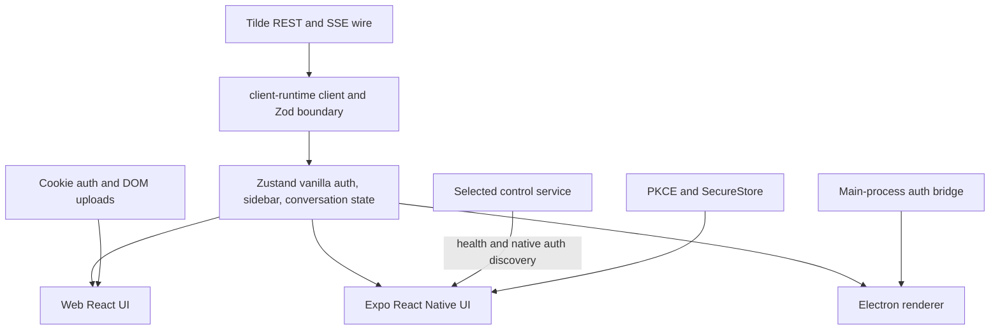

# ADR-0017: Shared client runtime and Expo mobile

## In brief

- One `client-runtime`. Group UI contracts by installation, auth, sidebar, messages, events, queue, attachments, platform.
- Zustand vanilla store owns client snapshots and live reconciliation. No React, DOM, Expo, or Node dependency.
- Web and Expo render separate components. Share behavior and data, not JSX.
- Tilde REST and SSE stay wire authority. No duplicate server protocol package.
- Mobile starts control selection, auth, sidebar, regular chat. No offline queue or Computer surface yet.
- Runtime is mandatory for major UX surfaces and state interactions. Presentation-only state stays local.
- BNA UI is the mobile component library. Copy-in source under `apps/mobile/src/components/ui`, tokens in `theme/colors.ts`.

## Context

Web previously combined Tilde wire parsing, SSE reconciliation, conversation state, DOM uploads, and
React rendering in one screen. Expo needs the same authenticated workspace behavior but cannot reuse
DOM components or Electron's privileged bridge. A package containing only copied wire interfaces
would still leave behavior duplicated, while a universal component layer would either leak platform
APIs or reduce the native app to web-shaped UI.

## Decision

`@tryopenbot/client-runtime` owns the framework-neutral owner-client boundary. Its contracts are
small Zod schemas and inferred types grouped by UI capability: installation, authentication,
sidebar, messages, events, queue, attachments, and platform bridges. The schemas validate data where it enters the
client. They describe what OpenBot UI needs from Tilde's existing REST/SSE wire shapes; they do not
create a new control-service protocol or claim ownership of Tilde resources.

The package also owns the fetch/SSE client, pure event reducers, auth adapter contract, and a
Zustand vanilla store. The store is divided into auth, sidebar, and conversation slices and owns
remote snapshots plus live-event reconciliation. Using one external store avoids two authorities
for the same session graph while SSE events and refresh responses arrive concurrently. Components
subscribe through each platform's Zustand binding and keep only ephemeral presentation state such
as drafts, menus, scrolling, and local file pickers. Tokens remain inside platform auth adapters.

Use of the runtime is mandatory rather than preferred, because an optional shared layer decays into
per-client reimplementation. Every major UX surface and state interaction is expressed as a runtime
contract: state that crosses the network, must survive navigation or reload, has to behave
identically on more than one client, or is read by another surface. Installation and control-service
selection, authentication, sidebar and session navigation, conversation and message state, event
streams, queues, attachments, and platform bridges are therefore runtime-owned. Presentation-only
state stays in the component that renders it — hover, focus, and active styling, transitions,
tooltips, menu visibility, scroll position, input drafts, and layout sizing. When a new surface needs
state the runtime does not model, the grouped contract is extended first and the renderer is written
against it; behavior is not shipped in a renderer for later extraction.

The runtime imports no React, DOM, Expo, React Native, Electron, or Node APIs. Web owns cookies and
DOM attachment upload; Electron main owns native credentials and exposes the bounded shared bridge
contract; Expo owns PKCE, SecureStore, navigation, native file selection, and React Native views.
Web and mobile therefore share contracts and behavior but render separate component trees.

Before authentication, Expo asks the Owner for a control-service origin. It requires HTTPS outside
loopback development, verifies the OpenBot health response, loads public native PKCE metadata from
`/auth/native-config`, and persists only the normalized origin in SecureStore. A service change
clears installation-scoped credentials before creating a new runtime.

Mobile presentation uses BNA UI (`https://ui.ahmedbna.com`), an Expo and React Native component
library distributed the way shadcn distributes web components: `bna-ui add <component>` copies
component source, hooks, and theme files into the app and installs their npm dependencies. The
copied source lives in `apps/mobile/src/components/ui`, `apps/mobile/src/hooks`, and
`apps/mobile/src/theme`, and is owned and editable by this repository rather than pinned to a
library version. `packages/ui` stays web-only because it is React DOM; a shared component layer
across DOM and native would either leak platform APIs or flatten the native app into web-shaped UI,
which is the same reason web and Expo already render separate trees.

Colors are read through `useColor` against the `theme/colors.ts` light and dark token sets, so no
Expo surface hardcodes a color, and `ModeProvider` persists the appearance choice through
`expo-secure-store`. Adding a component is `pnpm dlx bna-ui add <name>` from `apps/mobile`, which
depends on the `@/*` path alias resolving to `apps/mobile/src`. The trade-off accepted here is that
copied source does not receive upstream fixes automatically; the compensation is that the component
layer is reviewable, patchable, and diffable in this repository like any other code.

The initial Expo slice then supports authentication, agent and session navigation, creating a
session, loading and streaming regular messages, interruption, and sign-out. It does not promise offline
sending, background delivery, attachment picking, rich desktop workspace panels, or Computer
control. Those require separate product and platform decisions.

## Consequences

- Live chat behavior and UI-facing shapes have one tested implementation across clients.
- Web-specific UI remains reusable through `packages/ui` where React DOM applies; Expo receives
  native components from BNA UI instead of compatibility wrappers.
- The two client component layers evolve separately, so a visual decision has to be expressed twice.
  The shared layer is tokens and behavior, not markup.
- Adding a UI field requires updating the grouped client contract and its boundary validation.
- The runtime is not a general server SDK. Provider contracts and Computer ConnectRPC remain in
  their owning packages.
- A later independently cacheable domain may justify query-core, but conversation state must retain
  one explicit reconciliation owner.

## Updates

- 2026-08-20T11:45:00+01:00: Modelled control-service connections as a persisted client workspace
  registry owned by `client-runtime`. Web stores only public origins, labels, avatar colours, and the
  active workspace on-device; browser cookies and native credentials remain installation-scoped in
  their existing platform adapters. Switching hosted web workspaces transfers only that public
  registry and reloads the destination installation's full application shell.
- 2026-08-20T12:05:00+01:00: Made the Tilde agent-turn queue authoritative for every owner message.
  The client reconciles pending turns independently of long-lived send requests, owns optimistic
  queue mutations, and uses reply IDs rather than wall-clock completion time to order late replies.
  Vite development also seeds its loopback control server into the persisted workspace registry.
