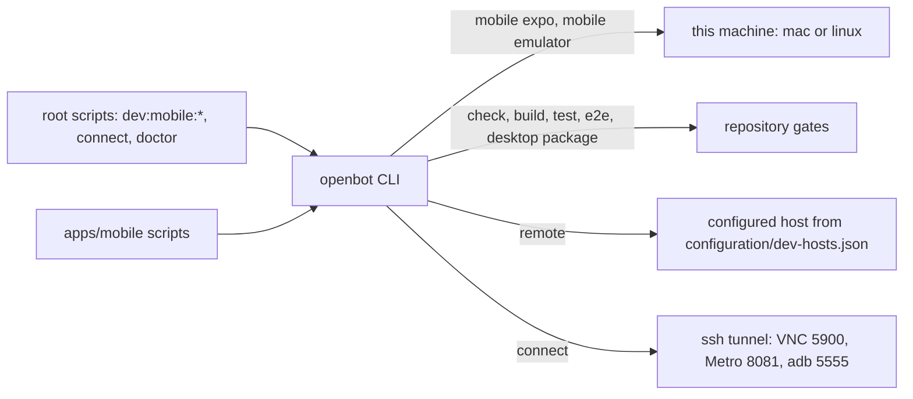

# ADR-0018: Developer workflow commands in the operator CLI

## In brief

- The `openbot` CLI owns the entire developer workflow alongside operator commands.
- Repository gates: `check`, `build`, `test`, `e2e`, `desktop package`.
- Mobile group: `openbot mobile expo|emulator|avd|setup|screenshot|logs|doctor`.
- Remote hosts: `openbot connect <host>` and `openbot remote <host> <task>`.
- Every developer workflow lands as an `openbot` command — never loose `scripts/*.mjs`, package-local helpers, or command lines living only in skill prose.
- Root scripts follow t3code's verb:target taxonomy (`dev:mobile:*`, `connect`, `doctor`) as thin plumbing.
- Remote host identity is fork-owned `configuration/dev-hosts.json`, never package code.
- Argv-first with plain output and exit codes; Ink renders only interactive surfaces.
- No Effect. Plain Node APIs.

## Context

Mobile development introduced machine topology the repository never had: the Expo client is
developed on four targets — local mac, local Linux, remote mac, remote Linux — and a
display-less remote needs a headless emulator, loopback VNC, and ssh tunnels to be usable.
That logic first accumulated as untested `apps/mobile/scripts/*.mjs` with no owner, no help,
and no path to a fork developer's or sandboxed agent's hands.

A separate published `@tryopenbot/dev-cli` package was built first, on the theory that the
operator CLI and the developer CLI serve different audiences with different dependency
weight. That boundary did not survive contact: the fork developer and the sandboxed agent
already have the `openbot` CLI in hand, the CLI already fronted `check`, `build`, and `test`
through the same delegation the gates need, versions were locked together by the fixed
changeset group anyway, and two binaries meant two help surfaces for one repository. The
package was folded into `cli` and deleted in the same branch that introduced it.

t3code's root-script taxonomy remains worth copying: a flat verb:target scripts block makes
every entrypoint discoverable from one file, with anything orchestrated delegated to the CLI
rather than inline shell.

## Decision

The `openbot` CLI is the single command surface for operating an installation and developing
the codebase. Sandboxed agents may fork, modify, and develop the repository, so the developer
workflow is product surface and ships in the published CLI.

Developer commands: repository gates `check`, `build`, `test`, `e2e`, and `desktop package`
delegate to the root `package.json` scripts, which remain the single definition of what each
gate runs — the CLI never duplicates a vp command line. The `mobile` group owns the Expo
workflow: `expo` (the Expo CLI against the workspace app that depends on `expo`, with
`ANDROID_SDK_ROOT`, `ANDROID_HOME`, and a real Node binary resolved before spawning, because
Gradle shells out to `node` during settings evaluation), `emulator` (idempotent; headless
Xvfb and loopback-only x11vnc on Linux, windowed on mac), `avd`, `setup` (idempotent SDK
provisioning that reports root-only system packages instead of installing them),
`screenshot`, `logs`, and `doctor`. `connect` opens the ssh tunnel carrying VNC, Metro, and
adb to a workstation; `remote` runs a task on a configured host, and `ios` requires a mac
host. `connect` and `remote` stay top-level because they address development hosts, not the
mobile app.

Every developer workflow lands as an `openbot` command, not as loose `scripts/*.mjs` files,
package-local scripts, or command lines living only in skill prose. Root `package.json`
keeps the verb:target taxonomy as thin plumbing; trivial single-filter delegations remain
plain scripts. `create-pr` enforces this with a CLI ownership gate before publication.

Remote host names, addresses, platforms, and repository paths are fork-owned configuration
in `configuration/dev-hosts.json`, which the upstream sentinel already keeps untracked. Any
command also accepts a raw `user@host`. Developer commands require a repository checkout and
fail with a clear error outside one; operator commands like `init` keep working in an empty
directory.

## Consequences

- One binary, one help surface, one publish cadence for operator and developer workflow;
  fork developers and sandboxed agents get identical, versioned tooling from the registry.
- Every dev command is public API: renaming a command or flag is a versioned change with a
  changeset, documented in `cli/README.md`.
- Operators who never develop the codebase carry the (small: arg, ink, tsx — already CLI
  dependencies) developer command code; dev-tooling churn now releases the operator CLI.
  Accepted deliberately in exchange for one surface.
- The four-target matrix has one owner with tests; process-probe and PATH-resolution lessons
  live in code rather than skill prose.
- No host identity ships in the package.

## Updates

- 2026-08-29T07:28:00+02:00: ADR-0033 removed the mobile command group, Android/iOS toolchain resolution, Metro/adb tunnels, and EAS release surface. `connect` and `remote` now serve Electron desktop development only.
- 2026-08-18T13:30:00+02:00: Initial decision as a separate published `@tryopenbot/dev-cli`.
- 2026-08-18T14:20:00+02:00: Grouped every mobile command under `mobile <subcommand>` and added `avd`, `setup`, `screenshot`, and `logs`.
- 2026-08-18T15:00:00+02:00: Repository gates became commands; every developer workflow must land as a command; `create-pr` gained the CLI ownership gate.
- 2026-08-18T15:40:00+02:00: Folded `dev-cli` into the `openbot` CLI and deleted the package. One command surface for operators, developers, and agents; the audience split had produced two binaries with one fixed version and duplicate gate delegation.
<!-- # DO NOT UPSTREAM -->
<!-- #reason: Fork-only private trytilde/api submodule workflow. -->
- 2026-08-25T17:31:54+01:00: Added `openbot dev --local-tilde-api [ORIGIN]`, including shallow private-submodule initialization and supervised `make dev` startup when its selected socket is not already listening.
<!-- #END DO NOT UPSTREAM -->
