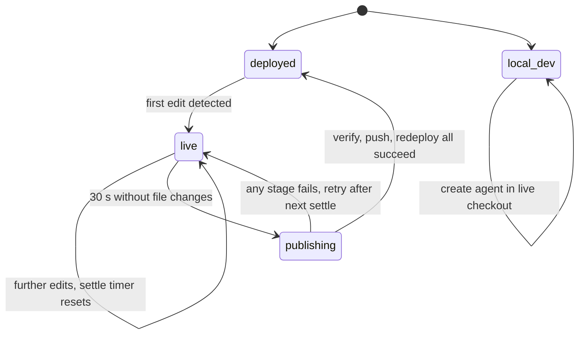

# ADR-0019: Sandbox live runtime and background SDLC reconciliation

## In brief

- Background orchestrator owns the lifecycle. Agents never build, test, or deploy themselves.
- First edit flips every agent to the tunnel. Whole-repo, never per-agent.
- Settle 30 s, then verify, publish to `openbot/sandbox-edits`, redeploy, flip back.
- Local `openbot dev` creates agents in its live checkout. Deployed creation stays in sandbox.
- Workspace UI has no build/test/deploy modes. One continuous chat.
- Cost: every agent's tools run inside the trusted development sandbox. Accepted.

## Context

Agents were previously moved between the local-runtime tunnel and their deployed endpoints by an
explicit owner action — a Deploy step in the workspace UI, or a factory-agent skill that committed,
pushed, and ran `openbot deploy`. That made the software lifecycle a decision an agent had to be
aware of and get right, and it split the owner experience into build, test, and deploy modes.

The target experience, established by the reference build the workspace UX was derived from, is
that creating and tweaking an agent is one continuous chat and instruction changes take effect
immediately. OpenBot agents are authored TypeScript, so a lifecycle still exists — but agents
should not be the ones driving it.

## Decision

- A background orchestrator (`openbot orchestrate`) owns the lifecycle. It serves agents from the
  trusted development sandbox through the Tilde local-runtime tunnel with hot reload and watches
  the checkout for edits.
- The first edit flips **every** agent to the tunnel (whole-repo, never per-agent: changes to
  shared files can affect any agent). After edits settle (30 seconds without file changes), the
  orchestrator verifies the project, commits and pushes the tree to the `openbot/sandbox-edits`
  branch through the Tilde git reverse proxy, redeploys agent services, and flips agents back to
  their deployed endpoints. A failed stage leaves agents on the tunnel and retries after the next
  settle.
- The watcher ignores lifecycle-owned paths (`configuration/.env`, `secrets.enc.yaml`,
  `.sops.yaml`) so its own writes never retrigger it.
- Agents are lifecycle-unaware. Factory skills no longer test or deploy; every scaffolded subagent
  receives a `self-edit` skill and computer tools that run in the development sandbox, so any agent
  can edit its own instructions, skills, and tools — the orchestrator makes the edits live.
- The workspace UI has no build/test/deploy modes. `POST /api/agents` uses the repository CLI in
  the checkout that owns the live agent runtime: local `openbot dev` runs `openbot new-agent`
  directly in its local checkout, while a deployed control service delegates the same command to
  the trusted development sandbox. Both paths open a chat with the created agent; production never
  gains direct access to an operator's local checkout.

The orchestrator runs supervised inside the development sandbox: the sandbox setup script installs
a restart-looped supervisor that starts `openbot orchestrate` with the sandbox age identity, and
the computer image carries the pinned `cloudflared` binary the local-runtime tunnel requires.

## Consequences

- The development sandbox needs to be awake only while agents are editing — which is exactly when
  it is awake, because agent tools execute in it. When the pipeline lands, agents serve from the
  deploy provider and the sandbox may sleep.
- Every agent's tools run in the trusted sandbox, so every agent operates inside the trust
  boundary that previously applied only to the factory agent. A fork running untrusted third-party
  agents must weigh this before adopting.
- `openbot/sandbox-edits` accumulates automated commits; merging them into the default branch is
  an explicit owner (or agent, on request) action via pull request.
- Local development agent creation mutates only the explicitly running checkout and inherits its
  operator environment. Deployed creation retains the sandbox API key and trust boundary.

<FOLLOW UP>
Automate the rest of the SDLC around the sandbox-edits branch: the orchestrator (or an agent
acting on owner intent) should open pull requests from `openbot/sandbox-edits`, keep them updated,
and merge them once checks pass, so the default branch converges with the live tree without manual
git work.
</FOLLOW UP>

## Updates

- 2026-08-18T16:30:00Z: Renumbered from 0017 to 0019. PR 57 and PR 47 both claimed 0017
  concurrently; PR 47's shared-client-runtime record merged first and keeps the number, and PR 48
  had already taken 0018. Restructured to the `docs/adrs/README.md` template: added `In brief`,
  replaced the nonstandard `Status` section with the accepted-date note carried here, and added the
  orchestrator state diagram. Named the UX source as the reference build rather than the
  third-party product, per repository convention. Accepted 2026-08-18.
- 2026-08-26T15:31:31+01:00: Split agent creation by runtime ownership: local `openbot dev`
  scaffolds in its live checkout, while deployed control services continue through the trusted
  development sandbox.
- 2026-08-27T15:15:00+02:00: Added the optional exe.dev mode from ADR-0032, where the trusted
  development lifecycle is itself the continuously running deployment and therefore never flips
  back to a separately built runtime.
- 2026-08-29T14:12:00+02:00: Made `openbot new-agent` the sole source and remote-resource
  reconciliation lifecycle for owner-facing creation. The control service now reports the
  background command result instead of repeating Tilde bundle provisioning with a separate human
  bearer token; an authorized installation agent API key may establish the new agent lifecycle.
