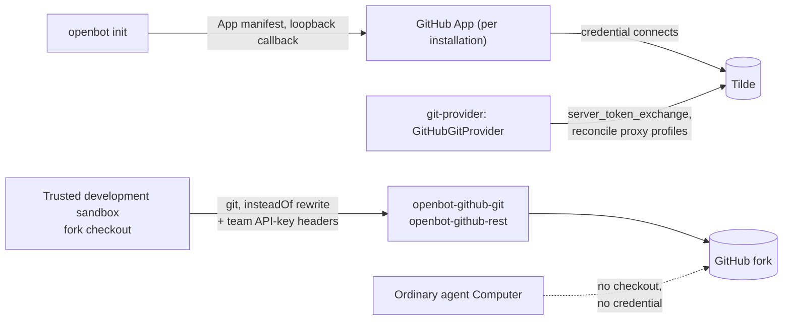

# ADR-0020: Brokered hosted-git access and the fork-holding development sandbox

## In brief

- Hosted-git access is a provider domain. `git-provider` owns it. GitHub and Code Storage have distinct credential models.
- Credential is a Tilde-brokered GitHub App via `server_token_exchange`. No raw PAT. No token in the repository, in `configuration/`, or inside any Computer.
- Sandboxes reach GitHub only through the `openbot-github-rest` and `openbot-github-git` reverse proxies. Repository-local git config, team API-key headers.
- The trusted development sandbox is the sole checkout holder. Ordinary Computers never get the fork or control-plane credentials.
- Init derives the fork repository from `origin` and never blocks on authorization; the deployment lifecycle is the idempotent finisher.
- Cost: git operations depend on Tilde availability. Accepted.

## Context

ADR-0013 bootstrapped forks with direct `gh` and `git` orchestration and recorded that as temporary
coupling, deferring a code-forge or `GitProvider` domain to follow-up work. That debt came due when
agents gained the ability to edit their own source: the background orchestrator of ADR-0019 has to
publish a real branch to the owner's fork from inside a sandbox, on every settle, with no human
present.

The obvious implementation — mint a personal access token, put it in encrypted configuration, hand
it to the sandbox — is the one that must not happen. A token that reaches a Computer is a token that
reaches agent-authored code running in that Computer, and OpenBot's security story depends on agent
code never holding control-plane credentials. The reasoning is not visible from the call sites, so a
later contributor could "simplify" the proxy away and silently dissolve the boundary.

## Decision

Hosted-git access is a provider domain. `packages/git-provider` defines the `GitProvider` contract
in `src/core.ts`; `GitHubGitProvider` is the first and only adapter. The composition root gains a
`providers.git` slot.

The credential is a GitHub App, provisioned through Tilde's provider-app flow and brokered per
request via `server_token_exchange`. OpenBot never holds a raw PAT and never persists a usable
GitHub token; only non-secret `GIT_GITHUB_*` identifiers land in `configuration/.env`.

Sandboxes never authenticate to GitHub directly. The provider reconciles two Tilde reverse-proxy
profiles — `openbot-github-rest` for `api.github.com` and `openbot-github-git` for `github.com` —
and the development sandbox gets repository-local git configuration whose `insteadOf` rewrite sends
every `https://github.com/` operation through the proxy with team API-key headers. The sandbox holds
no GitHub secret, so a compromised agent process cannot exfiltrate one.

Only the trusted development sandbox holds the fork checkout. Ordinary agent Computers do not get
the repository and do not get the proxy configuration.

Authorization is interactive but never blocking. `openbot init` derives the fork repository from the
checkout's `origin` remote, asks for the App name (globally unique per customer) and an optional
owning organization, and serves GitHub's App-manifest form from an ephemeral loopback server. A
non-interactive or failed run degrades to a `git.github.authorization.required` event; the
deployment lifecycle reconciles the proxy profiles and sandbox remotes idempotently once the
credential connects.

## Consequences

- Git operations depend on Tilde availability; a proxy outage stops publishing rather than falling
  back to a direct authenticated path. Accepted, because the fallback is the boundary violation.
- A second forge is a new adapter behind the same contract, not a new credential story.
- Forks must rerun `openbot init` to gain the `providers.git` slot and complete App authorization;
  a fork that hand-maintains `configuration/index.ts` adds the slot itself.
- ADR-0013's temporary `gh`/`git` coupling is retired for sandbox-side operations. Contributor-side
  bootstrap flows that still shell `gh` on a developer machine are unaffected.

## Updates

- 2026-08-18T16:30:00Z: Recorded retroactively while backfilling PR 57's documentation. The decision
  shipped with that PR; only the record is new.
- 2026-08-27T15:15:00+02:00: Added Code Storage as the machine-oriented hosted adapter. Its
  organization key is setup-only and transient; OpenBot persists only a repository-scoped,
  read/write, no-force-push JWT. Repository creation may opt into GitHub App continuous sync or a
  one-time public import.
- 2026-09-03T02:25:00+02:00: Kept Code Storage checkout remotes credential-free. Reconciliation now
  configures a host-scoped Git credential helper that reads the persisted repository JWT from the
  managed environment when a fetch or push needs it, including the persistent exe.dev runtime.
