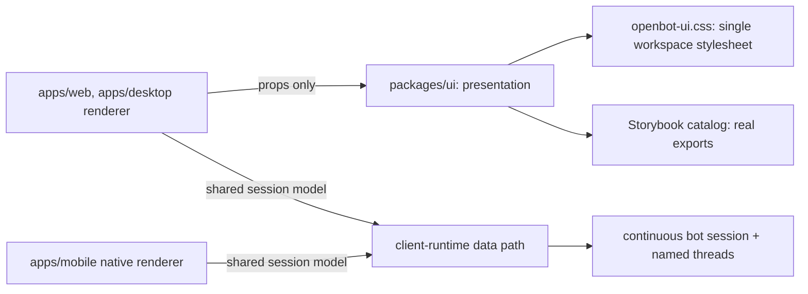

# ADR-0023: Workspace UI package owns presentation; applications own data

## In brief

- `@tryopenbot/ui` owns presentation: markup, class names, motion, component state. No fetching in the package.
- Applications own data, routing, composition. `apps/web` passes props. No app-local workspace stylesheet.
- One stylesheet: `@tryopenbot/ui/openbot-ui.css`, exported from the package. `apps/web/src/styles.css` deleted, not overridden.
- Storybook is package-owned and imports the real exports. No demo app, no duplicated production components.
- One continuous bot conversation per agent, plus selectable named threads. No duplicate bot session row.
- Cost: every visual change is a package change with a changeset and a version bump. Accepted for reuse across web and desktop.

## Context

The workspace UI grew inside `apps/web`, which left markup, the workspace stylesheet, and the message
rendering path owned by one application. The desktop shell renders the same surfaces, and a second
consumer cannot reuse components that live in an application's source tree.

The reasoning is not visible from the code. A reader seeing `apps/web/src/main.tsx` import
`@tryopenbot/ui/openbot-ui.css` cannot tell whether an app-local override is still permitted, and
later work has already assumed the boundary exists — ADR-0021 governs class naming inside the
package, ADR-0022 governs vendored component sources inside it — without any record establishing
that the package owns presentation in the first place.

## Decision

`@tryopenbot/ui` owns presentation. Markup, class names, motion, and component state live in the
package, and nothing in the package fetches. Applications own the data path, routing, and
composition, and drive components through props.

The workspace stylesheet moves with that ownership. `packages/ui/src/openbot-ui.css` is the single
workspace stylesheet, exported through the package's `./openbot-ui.css` entry. The app-local
`apps/web/src/styles.css` is deleted rather than kept as an override layer: a fork or application
that needs its own styling adds a fork-owned stylesheet imported after the package one.

Storybook is package-owned and imports the real exports, so the catalog cannot drift from what ships.
There is no separate demo application and no duplicated production component.

The product rule the surface encodes: one continuous bot conversation per agent, addressed by a
stable user-and-agent lookup key, plus selectable named threads. Every client presents the bot
conversation as the agent row and lists the remaining sessions as threads; it never duplicates the
bot session in the thread list.

## Consequences

- Every visual change is a package change: a changeset, a version bump, and a release. App-only
  styling tweaks are no longer possible by design.
- A fork that styled the web application must reapply its edits in the package stylesheet or in a
  fork-owned stylesheet layered after it. Restoring `apps/web/src/styles.css` does nothing, because
  the app no longer imports it.
- The catalog is only as honest as its imports. Stories must consume the real exports; a story that
  reimplements a component defeats the purpose.
- ADR-0021 and ADR-0022 sit inside this boundary: they govern naming and sourcing within the package
  this record hands presentation ownership to.

## Updates

- 2026-08-19T09:00:00Z: Recorded retroactively while backfilling PR 43's documentation. The boundary
  shipped with that PR; only the record is new.
- 2026-08-25T17:42:25+01:00: Replaced the no-thread product rule with one stable continuous bot
  conversation plus selectable named threads, rendered consistently across web, Electron, and mobile.
