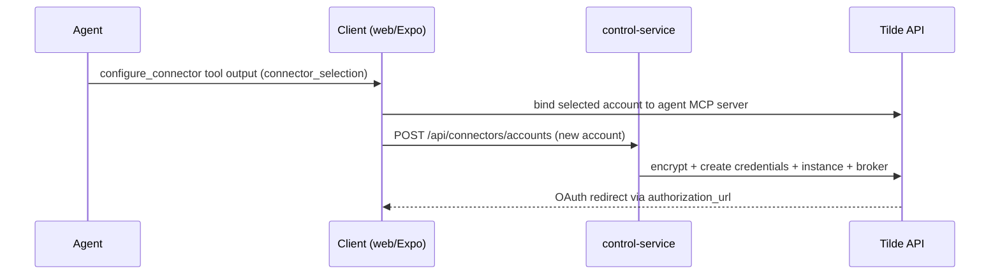

# ADR-0027: In-chat connector configuration

## In brief

- Bot configure own connectors. Agent tool `configure_connector` show account picker card in chat.
- Card payload travel as normal tool output (`connector_selection` key). No new message type, no proxy change.
- User picks account → client binds it directly to the agent MCP server through one idempotent Tilde API operation.
- Credentials never in chat. New-account forms post to owner-auth `/api/connectors/*` control-service routes, which encrypt and create credentials against Tilde and return a broker redirect URL for OAuth.
- Contracts and schema-to-field logic live in `client-runtime`; web and Expo render from the same payload. `packages/ui` stays presentation-only.
- Every agent template ships the tool plus eight Tilde platform skills (`tilde-connectors`, `tilde-tools`, `tilde-chatkit`, `tilde-memory`, `tilde-skills`, `tilde-state`, `tilde-dev-tunnels`, `tilde-control-plane`) synced into its Tilde skill registry.

## Context

OpenBot bots already carry the team-scoped Tilde control plane on their MCP servers, so an agent can in principle discover, enable, and map provider tools for itself. What was missing was the owner-facing half: no in-chat way to choose which provider account a bot should use, no secure path for entering new credentials, and no instructions teaching agents the discovery-enable-map workflow instead of improvising through the browser or shell.

## Decision

- The tool result carries both model-facing `instructions` ("card shown, end turn") and the client-facing payload, so the picker rides an ordinary tool part without adding a transcript message type.
- `splitMessageSegments` routes completed `configure_connector` parts to their own transcript row so ADR-0025 tool-chip collapsing does not swallow the card.
- The selection is a direct client mutation carrying `tool_group_source_type_id` and `tool_group_instance_id`. Tilde enables and maps the selected account atomically, so connector setup does not consume a second model turn.
- The control service, which already holds the team API key for the chat proxy, owns the credential write path so secrets stay server-side.

## Consequences

- New package `@tryopenbot/connector-tools` (Tilde-facing runtime utility for authored agents, sibling of `computer-tools`).
- Existing forks must migrate `configuration/agent` manually: add `tools/configure_connector.ts`, register it in `agent.ts`, refresh `instructions.ts`, and copy the eight Tilde skills.
- Mobile renders the same payload natively, including API-key and custom-schema credential forms; brokered OAuth opens the system browser and the user taps Done to hand back to the agent.
- Provider branding comes from Tilde catalog metadata (`icon_url`, plumbed as `icon_url`/`iconUrl` through the payload, routes, and both clients) with an initials tile as the fallback while the live catalog omits it.
- Follow-up: accounts are create-only from chat — the setup form blanks secret fields and cannot re-submit an existing account with unchanged secrets; editing credentials stays in the Tilde dashboard for now.
- Brokered OAuth returns land on the public control-service page `/connectors/authorized`; the waiting dialog polls the account status and hands back to the agent automatically, and desktop flows are bounced from the system browser to the `openbot://connectors/authorized` deep link, which focuses the app window.
- Mobile mirrors the same return flow: the native sheet passes `connectorAuthorizedReturnUrl(controlOrigin, "mobile")`, the landing page bounces `client=mobile` to the `openbot://` scheme the Expo app already registers, and the sheet polls `waitForConnectorAccountActive` to auto-send the hand-back (Done stays as a manual fallback).

## Updates

- 2026-08-25T12:00:00+02:00: Replaced the model-mediated selection hand-back with direct client-to-Tilde account binding and consolidated provider catalog, account, and setup reads behind server-authored provider setup operations.
