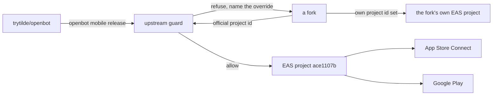

# ADR-0027: Official app store publication through EAS

> Historical publication decision. ADR-0033 removes the mobile client and EAS workflow from current main.

## In brief

- One published mobile app. `trytilde/openbot` owns the EAS project, bundle identifier, and both store listings.
- Tilde publishes, OpenBot is the app. EAS project `ace1107b-b007-451a-8e50-2b571c40593e`, owner `trytilde`, identifier `ai.trytilde.openbot`.
- Forks cannot publish to it. The guard is code in the CLI, not a comment in a config file.
- A fork releases its own app by setting `OPENBOT_EAS_PROJECT_ID`, `OPENBOT_APP_ID`, and `OPENBOT_EXPO_OWNER`.
- `app.json` becomes `app.config.ts` so store identity can be overridden without editing a tracked file.
- `openbot mobile release build|submit|status|credentials`. Nothing spends money or publishes without `--yes`.
- `eas-cli` runs through `npx eas-cli@latest`, deliberately unpinned.
- A `mobile-v*` tag releases through GitHub Actions, which calls the same CLI command a human would.
- Store credentials stay in EAS and Apple/Google, never in this repository.

## Context

OpenBot is forkable by design: ADR-0001 makes `configuration/` fork-owned, and every fork is a
real installation. App store publication does not follow that shape. There is one "OpenBot" in
the App Store and Play Store, one bundle identifier, one set of review relationships, and one
EAS project holding the signing credentials. That identity belongs upstream.

The risk is specific. A fork inherits every tracked file, so an inherited EAS project ID and
bundle identifier would let a fork run a build against the official project or, worse, submit
to the official listing. Permissions would refuse most of it, but relying on a remote service's
authorization to protect a public listing is not a boundary — it is a hope.

## Decision

Tilde is the publisher and OpenBot is the app, so the identifier is reverse-DNS of the
publisher's domain — `ai.trytilde.openbot` — rather than of the product name. The display name
stays `OpenBot`, and the Expo owner is the `trytilde` account that holds the store
relationships. An identifier cannot be changed after a first store submission, so it is fixed
before the first release rather than after.

`openbot init` neither asks about EAS nor requires it. Almost no fork publishes its own mobile
app, so making store publication part of initialization would charge every fork owner a
question, an account, and a failure mode for something they will never use. Publication is a
separate, upstream-only workflow reached through `openbot mobile release`; a fork that does want
its own app opts in by setting the environment overrides, and only then.

`trytilde/openbot` owns store publication. The official EAS project is
`ace1107b-b007-451a-8e50-2b571c40593e` under owner `trytilde`, with identifier
`ai.trytilde.openbot`, and `apps/mobile/eas.json` carries the development, preview, and
production profiles. Production uses `appVersionSource: remote` with `autoIncrement`, so build
numbers live in EAS rather than in a tracked file where every fork merge would conflict.

`app.json` becomes `app.config.ts`. Store identity reads from the environment with the official
values as defaults, so a fork overrides `OPENBOT_EAS_PROJECT_ID`, `OPENBOT_APP_ID`,
`OPENBOT_EXPO_OWNER`, and optionally the name, slug, and scheme from its own
`configuration/.env` without editing a file that upstream also owns.

Publication runs through `openbot mobile release`, per ADR-0018. Its guard refuses when the
resolved EAS project is the official one and `origin` is not `trytilde/openbot`, naming the
override a fork needs. This is deliberately narrow: a fork with its own EAS project is not
blocked, because the thing being protected is the official identity, not the act of releasing.
`build` and `submit` also require an explicit `--yes`, because both spend plan build minutes and
`submit` changes a public listing.

Releases are automated by tag rather than by branch. `.github/workflows/mobile-release.yml`
runs on a `mobile-v*` tag or a manual dispatch, and it invokes `openbot mobile release build`
rather than `eas-cli` directly, so CI and a human release through one code path with one guard.
The job is additionally fenced to `github.repository == 'trytilde/openbot'`; a fork's Actions run
would already fail the CLI guard and has no `EXPO_TOKEN`, but a public listing deserves a fence
that is readable in the workflow file. `openbot check` runs first, because an iOS build costs
plan minutes and a queue wait that a typecheck failure should not consume.

CI holds exactly one credential, `EXPO_TOKEN`, and holds it as a repository secret read from the
environment. Signing certificates, provisioning profiles, the App Store Connect API key, and the
Play service account key stay in EAS. A first iOS build therefore still runs interactively from a
terminal, because that is when EAS creates the distribution certificate; afterwards CI builds
unattended. Distribution to TestFlight is automatic on submission, while release to the public
App Store and beta review for external testers stay human decisions in App Store Connect.

`eas-cli` is invoked as `npx eas-cli@latest` rather than added as a dependency. It releases far
more often than this repository, and a pinned copy fails against the current EAS API; the cost
is that a release needs network access to fetch it.

Signing credentials, service account keys, and App Store Connect API keys stay in EAS and in the
Apple and Google consoles. None of them enter this repository, `configuration/`, or an ADR.

## Consequences

- One store identity with one owner, and a fork cannot reach it by inheriting tracked files.
- A release is a tag push, and the automation runs the same command a maintainer would run by hand.
- A fork that wants its own app has a documented path and no patch to maintain.
- `app.config.ts` replaces `app.json`, so Expo config is now code. It must stay free of secrets
  and of anything requiring a build step.
- Releases need an authenticated `eas` session and paid Apple and Google accounts, so they
  cannot run in an ordinary CI job without credentials.
- Build numbers live in EAS. Reading the current version means asking EAS, not the repository.
- `npx eas-cli@latest` means a release depends on the network and on upstream not shipping a
  breaking CLI change mid-release.

## Updates

- 2026-08-29T07:28:00+02:00: Superseded operationally by ADR-0033. Main no longer contains the mobile app or EAS publication workflow; the complete prior implementation is preserved only on the DO NOT MERGE mobile archive branch.
- 2026-08-19T10:20:00+02:00: Initial decision.
- 2026-08-19T10:55:00+02:00: Named Tilde as publisher and OpenBot as the app, moving the identifier from `dev.openbot.mobile` to `ai.trytilde.openbot` before any store submission, and recorded that `openbot init` must never ask about EAS or require it.
- 2026-08-19T13:40:00+02:00: Hardened the guard against an empty `OPENBOT_EAS_PROJECT_ID`. GitHub Actions substitutes an empty string for an unset repository variable, and `??` accepted it, so the official project compared unequal to itself and the refusal never fired. Overrides now read through `optionalEnvironment`, which treats empty and whitespace as absent.
