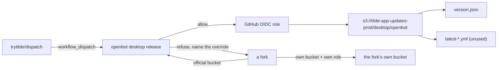

# ADR-0028: Desktop release publication and update metadata

## In brief

- One published desktop app. `trytilde/dispatch` owns the artifacts and the update feed.
- Artifacts go to the existing shared bucket `tilde-app-updates-prod` under `desktop/openbot/<channel>/`.
- No new bucket. Tilde's own Electrobun feed already lives at `desktop/`, and public read is granted to `desktop/*`, so the nested prefix inherits it.
- Forks cannot publish there. The guard is code in the CLI, and a scoped GitHub OIDC role is the backstop.
- A fork publishes its own builds by setting `OPENBOT_DESKTOP_UPDATES_BUCKET`.
- `openbot desktop release build|publish|manifest|status`. Nothing uploads without `--yes`.
- `version.json` is the client contract, keyed by platform. `latest-*.yml` rides along unused for a later electron-updater.
- macOS is signed with a Developer ID certificate and notarized through notarytool. Missing credentials degrade to an unsigned build, recorded as `signed: false`.
- Manually triggered only. Nothing releases on a push or a tag.

## Context

ADR-0027 settled mobile publication: one store identity, owned upstream, with the refusal in
code because a fork inherits every tracked file. The desktop app has the same shape and none of
the machinery. `openbot desktop package` produces a local unsigned build and stops there.

Three facts about the existing infrastructure shaped this.

The bucket already exists. `infrastructure-terraform/shared/app_updates.tf` defines
`tilde-app-updates-prod` in the shared account, versioned, CORS-enabled, with public read on
`desktop/*` and a 90-day non-current expiry. It hosts Tilde's own Electrobun desktop feed under
`desktop/stable-macos-arm64-*`. Adding a second bucket would have duplicated roughly a hundred
lines of Terraform to separate two feeds that a prefix already separates.

There is no GitHub OIDC provider in AWS. The infra repository's own notes claim shared-prod has
one; it does not. The current desktop publisher is `tilde-desktop-release-uploader`, an IAM user
with a long-lived access key defined in `identity-terraform/release_uploader.tf`. Reusing that
identity would have put a standing credential into a second repository and shared one principal
across two products.

An unsigned macOS build is not distributable. Gatekeeper refuses it, and neither reference
implementation solves this — `trytilde/agent` ships Rust binaries through GitHub Releases, and
`faro-engineering/api` sets `identity: null` and publishes unsigned. Signing and notarization
are new work here rather than a pattern to copy.

## Decision

Artifacts go to `s3://tilde-app-updates-prod/desktop/openbot/<channel>/`. Reusing the shared
bucket costs one shared blast radius and saves a near-duplicate Terraform module; the nested
prefix inherits both the public-read statement and the lifecycle rule without editing either.

`cli/src/commands/desktop/release.ts` holds `officialUpdatesBucket` as a constant and refuses
when the resolved bucket is the official one and `origin` is not `trytilde/dispatch`, reusing
`isUpstreamRepository` from ADR-0027 verbatim. The bucket name being tracked is exactly why the
refusal must be code. A new GitHub OIDC provider in the shared account, with a role whose trust
policy names `repo:trytilde/dispatch:*`, is the backstop: a fork cannot assume it regardless of
what the CLI does. Neither workflow carries an `if: github.repository ==` guard, so a fork with
its own bucket and its own role runs both unmodified.

The version is whatever `@tryopenbot/desktop` already has. Changesets owns it through the fixed
group, so a release publishes the current version rather than inventing one, and `publish`
refuses a version already present unless `--overwrite` is passed.

`version.json` is the documented client contract: `schemaVersion`, `channel`, `generatedAt`, and
a `platforms` map keyed `darwin-arm64` / `linux-x64`, each carrying its own version, artifact
list with size and base64 sha512, and `signed` / `notarized` flags. Keying by platform means a
mac-only release reports honestly instead of claiming linux moved too. `manifest` rebuilds it
from the per-platform `release-<key>.json` entries already in the bucket rather than from one
job's state, so it is idempotent and a mac-only re-run leaves the linux entry standing.

electron-builder also emits `latest-mac.yml` and `latest-linux.yml` through a `generic` publish
provider. Nothing reads them today. They are published anyway so that adopting electron-updater
later is a client change rather than a re-run of every past release.

The Electron `appId` is `ai.trytilde.openbot`, matching the mobile identifier for the reason
ADR-0027 gives: the identifier is reverse-DNS of the publisher, not of the product or the
platform. Desktop and mobile therefore share one identifier, and one variable renames both:
`OPENBOT_APP_ID`, already read by `apps/mobile/app.config.ts`, now also resolves the Electron
`appId`. They are distinct records to Apple regardless, because the desktop app is distributed
with Developer ID rather than through a store, and nothing keys off the two being different.

macOS builds are signed with a Developer ID Application certificate and notarized through
notarytool with an App Store Connect API key, under the hardened runtime with the JIT
entitlements Electron requires. When the certificate secrets are absent the build proceeds
unsigned with a warning, because a fork without an Apple Developer account should still get
artifacts. The cost is that a misconfigured upstream run also succeeds, so the outcome is
recorded in `version.json` as `signed: false` where it is visible rather than silent.

`release-desktop.yml` is `workflow_dispatch` only. The matrix is macOS arm64 and Linux x64;
mac x64 is deliberately not built. Mobile keeps its own `mobile-release.yml`, which predates
this decision and additionally releases from a `mobile-v*` tag; this ADR does not change it.

## Consequences

- One update feed with one owner, and a fork cannot reach it by inheriting tracked files.
- OpenBot and the Tilde desktop app share a bucket. A policy or lifecycle change to
  `tilde-app-updates-prod` affects both.
- A new GitHub OIDC provider exists in the shared AWS account. It is a trust relationship with
  GitHub, and every future role scoped to it inherits that.
- Publishing needs the AWS CLI. It is present on GitHub runners; a local publish requires it.
- macOS releases depend on a Developer ID certificate and an App Store Connect key held as
  repository secrets, and notarization adds minutes of Apple round-trip to every mac build.
- Old versions are never pruned from the current-version set, because `latest-*.yml` names a
  specific file and rollback depends on it. Non-current versions still expire after 90 days
  under the bucket's existing rule.
- Nothing consumes `version.json` yet. The in-app update banner, its `client-runtime` contract,
  and the web/Expo parity decision it triggers are deliberately not part of this decision.
- Windows, linux arm64, mac x64, and `eas update` OTA are out of scope.
- The desktop workflow deliberately carries no `if: github.repository ==` fence, unlike
  `mobile-release.yml`. The two therefore differ: a fork can run the desktop release against
  its own bucket, but cannot run the mobile one at all without editing it.

## Updates

- 2026-08-19T13:30:00+02:00: Initial decision.
- 2026-08-19T15:10:00+02:00: Moved the Electron `appId` from `dev.openbot.desktop` to `ai.trytilde.openbot`, before the first signed release makes it permanent.
- 2026-08-19T15:35:00+02:00: Made that identifier environment-overridable through the existing `OPENBOT_APP_ID`, so a fork renames the desktop and Expo clients with one variable instead of editing a tracked file. It is applied as an `electron-builder` command-line override, not a `${env.*}` macro and not a spawn environment variable: electron-builder strips macros out of `appId`, and pnpm forwards a `--` separator through to the script rather than consuming it, so overrides must follow the script name directly. `package.json` keeps the official value as the literal default. Both paths are verified against `CFBundleIdentifier` in a packaged bundle rather than against the config.
