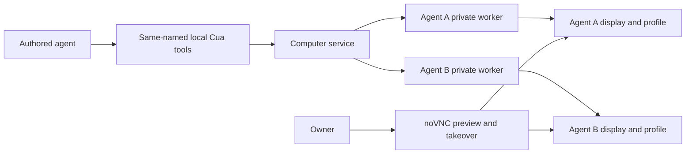

# ADR-0029: Cua Driver owns programmatic GUI automation

## In brief

- Cua Driver is the only programmatic GUI backend inside a Computer.
- Computer-service owns one private worker per agent display.
- Authored agents receive the runtime catalog as same-named local tools.
- noVNC remains owner-only preview and takeover.
- Cua runs unrestricted initially; telemetry is disabled.

## Context

OpenBot already routes each agent to a computer-service-owned virtual display and browser profile while keeping one shared Computer. Programmatic screenshots and input previously had separate command-backed implementations in computer-service and provider adapters. That duplicated ownership, limited agents to a small fixed action surface, and could bypass the same lifecycle used by richer GUI automation.

Cua Driver publishes a runtime tool catalog and a result envelope containing text, images, structured and raw JSON, verification state, degradation, errors, and explicit completion uncertainty. OpenBot needs that fidelity without exposing a generic model-facing dispatcher or moving display ownership into a provider.

## Decision

The Computer image pins matching Cua Driver 0.21.0 Linux executables and `@trycua/cua-driver` 0.21.0 SDK packages. Image bootstrap verifies the published SHA-256 for amd64 or arm64 and installs X11/AT-SPI runtime dependencies. Both supported telemetry environment switches are disabled.

Computer-service lazily creates one supervised private Cua worker for each validated agent ID after its desktop exists. The worker receives only that desktop's display, home, runtime directory, browser-profile root, and the service-selected unrestricted permission mode. Failed initialization is evicted so a later request can retry. Request cancellation and deadlines reach the SDK. Service shutdown drains and destroys every worker.

`ListCuaTools` and `CallCuaTool` are the internal typed API. Results preserve the catalog schema and the SDK envelope, including ordered content, uploaded-image bytes, structured and raw JSON, verification, degradation, error codes, and `not started`, `completed`, or `unknown` action completion. Legacy screenshot and input RPCs translate to Cua calls. Computer providers retain desktop preview/provisioning but no direct screenshot or input implementation.

`@tryopenbot/computer-tools` loads the complete catalog before an agent starts, converts each JSON Schema with the AI SDK JSON-Schema adapter, rejects name collisions, and exposes one local tool per identical Cua name. Returned images cross the existing session-scoped Tilde attachment boundary rather than becoming model-visible base64.

Agent Provider always reconciles an OpenBot-owned computer-use overlay. It prefers the trusted Tilde-managed `trycua/cua` `skills/gui-automation/SKILL.md` package and otherwise reconciles the provenance-recorded bundled snapshot. Managed availability replaces only OpenBot's fallback; the overlay and user-owned registry skills remain.

## Consequences

- GUI tool availability follows the installed Cua runtime exactly instead of an OpenBot-maintained action list.
- A worker or transport interruption can report unknown completion, so agent guidance requires observation before any retry.
- Display routing still is not process, filesystem, network, or authorization isolation.
- Unrestricted mode is a deliberate initial installation policy, not a permanent public default.
- No web, mobile, or Electron capability changes in this decision; noVNC behavior remains unchanged.

<FOLLOW UP>
Owner: packages/agent-provider Cua skill reconciliation
Trigger: the trytilde/api Cua provider PR is deployed to every supported Tilde environment
Work: remove the bundled canonical Cua fallback and require the managed provider's canonical cua-driver skill; prove existing registries replace the fallback without duplicate membership
</FOLLOW UP>

<FOLLOW UP>
Owner: Computer Service Cua worker policy
Trigger: sandbox-level Computer permission configuration is designed
Work: expose explicit per-installation or per-agent Cua permission policy with a safe configurable default and migration; preserve this fork's deliberate unrestricted selection
</FOLLOW UP>

<FOLLOW UP>
Owner: client-runtime, Computer Service, and agent skill lifecycle
Trigger: Cua Driver computer use and managed Cua skills are deployed and stable
Work: design an owner-guided demonstration flow using Cua recording, durable recoverable delivery, and automatic publication of learned skills to every OpenBot agent registry
</FOLLOW UP>

<FOLLOW UP>
Owner: mobile client
Trigger: the owner-guided demonstration contract exists and mobile gains an owner Computer surface
Work: add mobile Computer preview and demonstration controls with behavior matching web and desktop
</FOLLOW UP>
