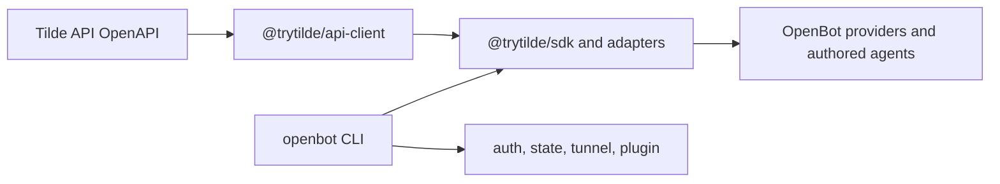

# ADR-0030: Tilde SDK and CLI ownership

## In brief

- Keep OpenBot product name. No umbrella rename.
- Tilde SDK packages live here. No Harness repository dependency.
- `openbot` owns auth, state, tunnel, plugin commands. No second CLI or plugin package.
- Public SDK names use `@trytilde/sdk*`. No `harness` package names.
- SDK versions stay independent. OpenBot fixed group unchanged.

## Context

OpenBot consumed the generated Tilde API client, core SDK, Vercel AI adapter, and Tilde CLI
from `trytilde/harness-sdk`. A single Tilde capability therefore required coordinated SDK and
OpenBot changes, releases, or Git commit pins. Coding agents also needed two repositories to trace
one call path. The Harness name described an old implementation context rather than a useful
public boundary.

OpenBot remains a distinct application: it owns installations, clients, Computers, provider
lifecycles, and deployment. Tilde remains the platform and SDK namespace. Source locality does not
collapse those product and state boundaries.

## Decision

The generated client, core SDK, React adapters, and Vercel AI adapters live under
`packages/api-client` and `packages/sdk*`. Their public packages are `@trytilde/api-client`, `@trytilde/sdk`,
`@trytilde/sdk-react`, `@trytilde/sdk-vercel-ai-node`, and `@trytilde/sdk-vercel-ai-react`.
Coding-agent MCP and skill-registry setup is an internal part of the OpenBot CLI, not another
public package. The old `@trytilde/harness-sdk*` and `@trytilde/harness-plugins` names receive no
in-repository compatibility packages.

The standalone `@trytilde/cli`, `tilde`, and `t` binaries are removed. Their authentication, team
selection, state import/export, and local-runtime tunnel commands become `openbot auth`,
`openbot state`, and `openbot tunnel`. Coding-agent resource setup becomes `openbot plugin`.
OpenAPI refresh and package validation become the `openbot sdk` developer command.

SDK package versions remain independent of OpenBot's fixed Changesets group because they are
general Tilde integration contracts with consumers outside the OpenBot application. Workspace
dependencies provide atomic source changes; packed-consumer smoke tests preserve the external npm
boundary. Existing auth and tunnel state locations are compatibility read paths, while new writes
use names without Harness.

## Consequences

- One repository and pull request can change a Tilde SDK contract and every OpenBot consumer.
- External SDK consumers keep a narrow package boundary and independent release cadence.
- Consumers of old Harness package names or the `tilde` binary need an explicit migration.
- Tilde API OpenAPI remains an external service contract even though generation now runs here.
