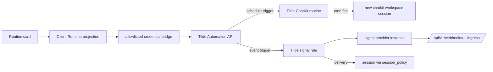

# ADR-0031: Routines and signals as one unified trigger surface

## In brief

- One user concept: Routine. Name, instruction, 1–8 triggers.
- Trigger is schedule or provider event; Tilde persists one authoritative Automation root and
  reconciles its ChatKit routine and signal-rule members.
- Legacy `metadata.openbot` groups are adopted idempotently by Tilde during listing.
- Client Runtime projects native Tilde Automation and Signals responses through the installation's
  operation-allowlisted `/api/tilde/*` credential bridge; there is no domain facade.
- Web renders an agent details pane; mobile is deferred.
- Self-hosted deviation: webhook URL and signing secret are user-visible.

## Decision

Tilde persists an Automation root containing the name, instruction, enabled state,
authorization planes, generation, reconciliation status, and 1–8 OR'd schedule or event
triggers. ChatKit routines and signal rules are materialized members rather than the public
source of truth. OpenBot retains the Routine product name and its existing client contract.

### Authoritative Tilde aggregate and legacy adoption

OpenBot creates or replaces one Automation with one PUT. Tilde validates the complete desired
state, persists it with a generation, creates or updates desired members before deleting obsolete
ones, and records partial failure on the root for retry. List/get return authoritative trigger
membership and schedule/run projections; run uses a durable client run ID.

Resources created by the previous implementation retain
`metadata.openbot = { group, trigger, instruction? }`. Tilde performs a bounded legacy scan during
Automation listing and atomically adopts each group as a generation-1 root. Concurrent or repeated
listing cannot duplicate the root or its materialized members. OpenBot does not retain a metadata
scan or a mapping database.

### Contracts and state

Wire shapes live in `packages/client-runtime` (`contracts/routines.ts`,
`contracts/signals.ts`) with the client methods and `routines`/`signals` store
slices, per ADR-0017. No Tilde event stream exists for these resources, so the
runtime polls while the details pane is open, stale-while-revalidate. Mutations
return the full refreshed routine list for the agent; clients replace wholesale and
never patch caches.

### Semantics

- Unified `enabled`, reconciliation status, generation, and error are authoritative root fields.
  Tilde ensures disabled event members are created disabled rather than briefly firing.
- Updates are full desired-state PUTs. Tilde preserves member identity where possible and
  safely replaces members whose immutable upstream identity changes.
- Test run calls the Automation run endpoint with a durable UUID, making retries idempotent.
- Root run history projects the latest scheduled run and its paired session/error. Signal delivery
  history remains available through the existing Signals API.
- One event trigger maps to exactly one signal rule and one signal type; filters are
  `filter.json_equals` equality on the provider's normalized payload.

### Pagination

Client Runtime follows Tilde Automation continuation tokens until exhausted and never rebuilds
the aggregate from independently paginated routine/rule collections. Legacy adoption is bounded and
fails visibly on overflow rather than silently producing an incomplete root.

### Provider connections

Signal provider instances are managed inline from the trigger card and inventoried
at `/settings/signals`. OpenBot is self-hosted, so provisioning is user-visible: the
client runtime pre-assigns `spi_` ids to render the deterministic webhook URL, and
the signing secret is supplied by the owner, write-only, placed in
`configuration.provider_webhook_signing_key`. Providers are catalog-driven, not
hardcoded; providers upstream cannot auto-provision (Slack today) surface the
upstream error verbatim.

### UX deviations from the reference experience

Recorded deliberately: UTC-only schedules (Tilde cron has no timezone), no interval
frequency, a delete confirmation dialog, single-event triggers, and surfaced webhook
provisioning. The details pane toggle uses `mod+alt+d` because `mod+alt+b` was
already bound to the Computer pane.

## Cross-client parity

- Web and Electron: shipped (Electron renders the same web tree).
- Expo mobile: deferred.

<FOLLOW UP>
Owner: apps/mobile
Trigger: this routines and signals capability merges for the web and Electron clients
Work: render the routines list, editor, and provider connect flow natively against the existing client-runtime contracts, slices, and helpers using BNA UI components and React Native sheets, then prove the workflows on both Android and iOS
</FOLLOW UP>

## Upstream dependencies

- `trytilde/api`: persisted Automations API, bounded legacy metadata adoption, schedule/run
  projections, authorization/grants, ownership lifecycle participation, and the serialized
  `webhook_verification` descriptor in the signals provider catalog.
- `@trytilde/api-client`: generated routines, signals, metadata, and webhook
  verification contracts. Stable hand-authored behavior remains owned by
  `@trytilde/sdk`; OpenBot does not reintroduce the retired Harness package names.

## Updates

- 2026-08-26T16:18:13+01:00: Replaced OpenBot's stateless metadata composition and mutation fan-out with Tilde's persisted Automation aggregate, retaining a thin owner-authenticated compatibility facade and automatic legacy adoption.
- 2026-08-29T00:34:00+02:00: Removed the Routines and Signals domain facades. Client Runtime now validates and projects the native Tilde resources through one operation-allowlisted credential bridge, retaining the HttpOnly installation session without duplicating Tilde APIs.
