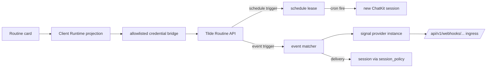

# ADR-0031: Routines and signals as one unified trigger surface

## In brief

- One user concept: Routine. Name, instruction, 1–8 triggers.
- Trigger is schedule or provider event; Tilde persists one native Routine root with native
  triggers and durable executions.
- Tilde migrates prior Automation, ChatKit Routine, and SignalRule state into the native root.
- Client Runtime projects native Tilde Automation and Signals responses through the installation's
  operation-allowlisted `/api/tilde/*` credential bridge; there is no domain facade.
- Web renders an agent details pane; mobile is deferred.
- Self-hosted deviation: webhook URL and signing secret are user-visible.

## Decision

Tilde persists a Routine root containing the name, instruction, enabled state,
authorization planes, optimistic version, and 1–8 OR'd native schedule or event triggers.
Schedule leases, event retry progress, and durable executions belong to that root. ChatKit
and Signals remain execution substrates rather than derived authorization resources.

### Authoritative Tilde root and legacy migration

OpenBot creates or replaces one Routine through the compatibility `/automations` path. Tilde
validates the complete trigger set and atomically persists the root and children. OpenBot sends the
current `version` as `expected_version`, and preserves server-owned action/session/metadata fields
when editing the presentation subset. List/get return native trigger membership; run uses a durable
client run ID.

Tilde's data migration copies prior Automation roots/members and standalone SignalRules before the
native API starts. OpenBot has no metadata scan or mapping database.

### Contracts and state

Wire shapes live in `packages/client-runtime` (`contracts/routines.ts`,
`contracts/signals.ts`) with the client methods and `routines`/`signals` store
slices, per ADR-0017. No Tilde event stream exists for these resources, so the
runtime polls while the details pane is open, stale-while-revalidate. Mutations
return the full refreshed routine list for the agent; clients replace wholesale and
never patch caches.

### Semantics

- Root and per-trigger `enabled` state are authoritative. There is no reconciliation generation or
  derived member that can briefly fire.
- Updates are full desired-state PUTs. Stable native trigger IDs preserve telemetry and retry
  progress; `expected_version` rejects concurrent replacement.
- Test run calls the Automation run endpoint with a durable UUID, making retries idempotent.
- Root run history projects the latest scheduled run and its paired session/error. Signal delivery
  history remains available through the existing Signals API.
- One event trigger selects one provider instance and signal type; filters are
  `filter.json_equals` equality on the provider's normalized payload.

### Pagination

Client Runtime follows Tilde Routine and Signals continuation tokens until exhausted and never
rebuilds the root from derived ChatKit/SignalRule collections.

### Provider connections

Signal provider instances are managed inline from the trigger card and inventoried
at `/settings/signals`. OpenBot is self-hosted, so provisioning is user-visible: the
client runtime pre-assigns `spi_` ids to render the deterministic webhook URL, and
the signing secret is supplied by the owner, write-only, placed in
`configuration.provider_webhook_signing_key`. Providers are catalog-driven, not
hardcoded; providers upstream cannot auto-provision (Slack today) surface the
upstream error verbatim.

### UX deviations from the reference experience

Recorded deliberately: UTC-only schedules (Tilde cron has no timezone), no interval
frequency, a delete confirmation dialog, single-event triggers, and surfaced webhook
provisioning. The details pane toggle uses `mod+alt+d` because `mod+alt+b` was
already bound to the Computer pane.

## Cross-client parity

- Web and Electron: shipped (Electron renders the same web tree).
- Expo mobile: deferred.

<FOLLOW UP>
Owner: apps/mobile
Trigger: this routines and signals capability merges for the web and Electron clients
Work: render the routines list, editor, and provider connect flow natively against the existing client-runtime contracts, slices, and helpers using BNA UI components and React Native sheets, then prove the workflows on both Android and iOS
</FOLLOW UP>

## Upstream dependencies

- `trytilde/api`: native Routine API, data-preserving migration, schedule/event execution,
  authorization/grants, ownership lifecycle participation, and the serialized
  `webhook_verification` descriptor in the signals provider catalog.
- `@trytilde/api-client`: generated routines, signals, metadata, and webhook
  verification contracts. Stable hand-authored behavior remains owned by
  `@trytilde/sdk`; OpenBot does not reintroduce the retired Harness package names.

## Updates

- 2026-08-26T16:18:13+01:00: Replaced OpenBot's stateless metadata composition and mutation fan-out with Tilde's persisted Automation aggregate, retaining a thin owner-authenticated compatibility facade and automatic legacy adoption.
- 2026-08-29T00:34:00+02:00: Removed the Routines and Signals domain facades. Client Runtime now validates and projects the native Tilde resources through one operation-allowlisted credential bridge, retaining the HttpOnly installation session without duplicating Tilde APIs.
- 2026-08-29T03:18:00+02:00: Replaced materialized ChatKit Routine and SignalRule members with Tilde's native Routine triggers. Client Runtime now preserves optimistic versions and native trigger metadata, pages Signals completely, and uses trigger IDs for delivery history.
