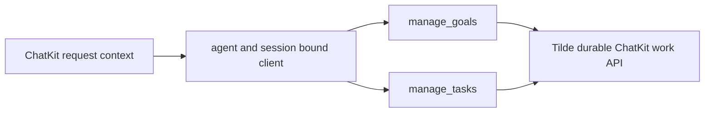

# ADR-0032: Agent-bound conversation goals and tasks

## In brief

- Use both goals and tasks: one records the desired outcome, the other records executable work.
- Bind the SDK and agent tools to the current agent and ChatKit session outside model input.
- Keep Tilde as the durable authority; OpenBot retains no parallel work database.
- Give authored agents durable bookkeeping guidance without exposing it as user narration.

## Decision

`@trytilde/sdk` exposes `client.chatkit.work({ agentId, sessionId })`, which returns
typed goal and task clients. Their methods cover create, get, list, update,
progress, complete, fail, and cancel. Agent and session IDs are fixed on the
client rather than repeated in mutation bodies; Tilde revalidates the agent's
machine principal and active session participation.

New agent scaffolds receive direct `manage_goals` and `manage_tasks` tools. The
agent creates a goal for substantial multi-step work, records independently
deliverable tasks, keeps unrelated work concurrent, uses dependencies only for
real ordering constraints, and closes items when delivered, failed, or canceled.
This state remains internal bookkeeping rather than progress narration.

## Consequences

Existing fork-owned agent files are not overwritten; the scaffold affects new
agents and owners may port the two tools into customized agents. Shared
client-runtime contracts expose read-only owner inspection, and the web,
Electron, and mobile **Work** surfaces show the active goal and task progress
without exposing host terms such as leases or generations.

## Updates

- 2026-09-01: Added owner-facing Work surfaces backed by shared runtime
  contracts while retaining Tilde as the sole durable authority.
