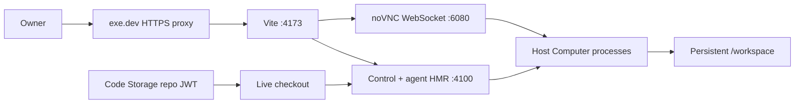

# ADR-0032: exe.dev single-VM trusted development runtime

## In brief

- One persistent exe.dev VM. Runtime plus Computer. 24/7.
- Run `openbot dev`, supervised by systemd user linger.
- Host is Computer. No process namespace. Whole 2-vCPU/8-GB VM may be used.
- Configuration secrets are available. This VM is trusted.
- Public Vite origin proxies capability-scoped noVNC and WebSocket traffic.
- Code Storage holds source. Repository JWT only after setup.

## Context

The consolidated runtime already ships web, control, and authored-agent endpoints as one release,
leaving the Computer as the second deployed service. A small owner-operated installation can trade
independent scaling and a narrower credential boundary for a much simpler always-on machine where
the live checkout, hot reload, agent endpoints, Computer, browser profiles, and background SDLC all
coexist.

exe.dev provides a persistent Linux VM, HTTPS proxying, and user-service supervision. Its
pooled 2-vCPU/8-GB plan is intentionally small, so fixed inner allocations would strand resources.
The existing development lifecycle also deliberately injects complete fork configuration into the
trusted development Computer. Promoting that lifecycle is therefore a security decision, not only
a hosting adapter.

## Decision

`ExeDevRuntimeServiceProvider` owns the outer VM lifecycle. It resizes one named VM, selects Vite's
port 4173 as the public HTTPS target, clones or fast-forwards the configured Code Storage branch,
installs dependencies, writes the aggregate fork configuration to a mode-`0600` environment file,
enables user linger, and supervises `pnpm dev` with systemd. Repeated deployment preserves a dirty
remote checkout rather than overwriting live edits.

`ExeDevComputerProvider` shares the same `ExeDevPlatform` identity. The outer production lifecycle
is runtime-owned; inside the VM, `HostComputerProvider` installs computer-service, Chromium,
Xvnc/noVNC, Cua, and desktop assets directly on Linux and supervises them with a systemd user
service. `/workspace/openbot` points at the same live checkout used by `pnpm dev`. The provider
shares one `COMPUTER_ID` with the trusted development sandbox. There is no inner process,
filesystem, user, network, CPU, or memory boundary.

The owner surface remains on Vite's public origin. The Computer provider rewrites its noVNC URL to
`/computer-vnc/`; Vite proxies both HTTP assets and WebSocket upgrades to loopback port 6080. The
existing agent-scoped VNC capability remains required.

Code Storage setup accepts an organization signing key as transient input. It may create the
repository with GitHub App or public sync and then mints an effectively long-lived (100-year by
default) JWT restricted to this repository,
`git:read`, `git:write`, and no force pushes. Only that repository JWT is persisted through SOPS.
The organization key is never written to `.env`, SOPS, the VM, or a Git remote.

## Consequences

- One VM failure, restart, or resource spike affects the entire installation.
- Every authored agent can reach the trusted Computer containing the live source and decrypted
  configuration. This mode is unsuitable for untrusted third-party agents.
- Development dependencies, watchers, and tunnels are production dependencies until this provider
  gains a built-runtime mode.
- VNC quality depends on owner-to-region latency and shared CPU pressure, but it avoids a second
  public port and preserves one same-origin browser path.
- Code Storage requires an `exp` claim, so the repository JWT cannot be literally indefinite. The
  100-year default avoids routine rotation; rerunning setup with a fresh organization key replaces it.
- GitHub App sync must be configured in Code Storage before creating a private synced repository.
