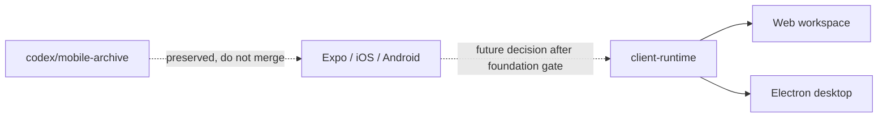

# ADR-0033: Pause the mobile client

## In brief

- Main supports the web workspace and Electron desktop shell only.
- Remove Expo, React Native, iOS, Android, EAS, mobile release automation, and mobile developer tooling from main.
- Preserve the complete pre-removal implementation on `codex/mobile-archive` in a labelled **DO NOT MERGE** PR.
- Keep `client-runtime` framework-neutral; it is shared by web and Electron today, not a promise that an unmaintained mobile renderer exists.
- Reintroducing mobile requires a new decision after the web/desktop foundation is stable.

## Context

OpenBot grew an Expo owner client while its control, ChatKit, tools, Computer, authentication, and deployment foundations were still changing quickly. Keeping Android and iOS in every build and parity gate made those foundational changes carry a second renderer, native toolchains, simulators, EAS credentials, and store-release infrastructure before the primary product path was stable.

The mobile implementation is useful work and must remain recoverable, but leaving it on main implies it is maintained and release-ready. It is neither. A Git branch and deliberately unmergeable PR preserve the exact source and history without keeping that operational promise in the active tree.

## Decision

Delete the Expo workspace package, mobile CLI group, Android/iOS toolchain support, Metro/adb tunnels, vendored Expo/EAS coding skills, EAS workflow, store configuration, and active contributor instructions from main. Web and Electron remain the two owner clients. Electron continues to render the web tree and may keep its native PKCE and privileged bridge.

Keep historical ADRs as records of what was built, with update notes pointing here. Push `codex/mobile-archive` from the last complete pre-removal tree. After this deletion merges, open that branch against main with a **DO NOT MERGE** label so the preserved implementation is visible, reviewable, and easy to resurrect without being mistaken for an active change.

Mobile may return only after the web/desktop foundation has stable contracts and deployed proof for authentication, agent creation, chat, tools/skills, Computer access, and upgrades. Reintroduction requires a new ADR that selects the supported native scope, refreshes dependencies rather than blindly reviving stale versions, restores platform checks and publication intentionally, and defines parity from the then-current product.

## Consequences

- Normal installs, checks, and builds no longer resolve or bundle Expo/React Native or require mobile toolchains.
- Main no longer carries EAS credentials, store-release commands, mobile tags, simulators, Metro, or adb workflows.
- Web/desktop changes have a two-client parity decision.
- Historical mobile documentation remains attributable but is superseded for current operation.
- The archive PR is not a release vehicle and must never be merged as-is; dependency and architecture drift must be reviewed when mobile work resumes.

## Updates

- 2026-08-29T07:28:00+02:00: Initial decision, explicitly requested by the product owner while stabilizing the OpenBot foundation.
