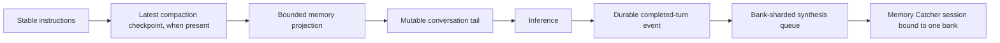

# ADR-0034: Opt-in automatic memory

## In brief

- The reusable Tilde SDK and OpenBot both default automatic memory to `none`.
  Owners opt in during initialization or with fork-owned environment settings.
- Tilde derives memory authority from the durable triggering ChatKit message;
  OpenBot never supplies a user identity or bank ID during recall.
- The agent inserts a deterministic bounded projection after stable instructions
  and any compaction checkpoint so provider prompt-prefix caching remains useful.
- Memory Catcher is a least-privilege user-deployed background agent with one
  server-bound synthesis session per bank and no memory bank of its own. It uses
  the installation's selected inference provider rather than separate model auth.

## Decision

OpenBot uses the high-level Tilde automatic-memory controller around inference.
An owner can select `none`, `personal`, `personal_plus_agent`, or `team`, and can
inspect, edit, or delete visible facts. OpenBot's deployment default is `none`.
`OPENBOT_AUTOMATIC_MEMORY_MODE` selects the installation default and
`AGENT_<ID>_AUTOMATIC_MEMORY_MODE` overrides one bot. Only
`personal_plus_agent` provisions a bot-owned bank; moving away sends an
explicit disabled bank spec so repeated deployment removes that owned bank.

Recall is tied to the newest durable triggering message ID. Tilde authenticates
the recipient bot, resolves the effective actor and current bank visibility, and
returns bounded provenance for the bank, memory, evidence, source, and learning
bot. OpenBot inserts that projection as a dynamic system suffix:

ChatKit, not the OpenBot model loop, performs idempotent post-turn evidence
enqueueing. Explicit owner facts remain owner-editable and protected from
automatic overwrite.

Memory Catcher uses the installation's selected inference provider, receives
only session-bound recall, retain, supersede, forget, and completion tools, and
never receives a model argument for a bank, tenant, or user. It has no automatic
memory mode or owned bank, preventing recursive synthesis. Its instructions
prohibit human messaging; dynamic `sendMessage` and unbound memory tools are
removed before inference.

## Consequences

- Cache-stable instructions remain byte-identical across turns; only the bounded
  memory suffix and conversation tail vary.
- Authorization stays in Tilde and follows current bank visibility rather than
  caller-declared identities.
- A failed or absent synthesizer does not block foreground inference; durable
  evidence remains queued until the configured bank synthesizer can process it.
- Forks must scaffold and deploy Memory Catcher and reconcile ordinary agents'
  memory bundle fields.
- Every synthesis mutation and completion is bound to the current claim's exact
  batch, complete evidence set, and fresh lease owner. Stale workers cannot
  adopt receipts from an earlier claim, and per-operation receipts make exact
  delete retries idempotent.
- The ordinary agent bundle names `memory-catcher` as the owned bank's
  synthesizer. Bundle reconciliation validates and converges that stable
  same-team reference on create, update, state import, and repeated deployment.

## Updates

- 2026-09-02: Memory Catcher now creates one durable AgentRun for each exact
  synthesis batch and worker lease. Before inference, Tilde validates the exact
  batch digest, complete evidence set, current unexpired lease, bound session,
  and assigned synthesizer. Managed Gateway inference uses the shared hosted-
  billing effect ledger, while redelivery of the same lease cannot repeat a
  planned, uncertain, or settled provider call.
