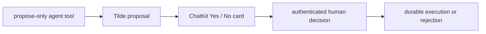

# ADR-0037: Safe self-extension is propose-only for agents

Status: Accepted

## In brief

- Authored agents receive a propose-only self-extension tool.
- Human owners approve or deny one exact change through an inline ChatKit Human
  Approval card; clients do not infer provider behavior or accept credentials.
- Tilde owns approval, durable execution, receipts, and exact rollback.

## Decision

The public SDK exposes proposal, list, inspect, approve, reject, cancel,
execution-wait, and rollback conveniences over Tilde's durable proposal API.
Default authored agents receive only `propose_self_extension`; approval and
execution are intentionally absent from the model tool set. The proposal body
contains references rather than secrets, and Tilde returns the complete generic
review preview.

The durable proposal is internal execution state, not a separate settings
product. The agent explains the change in ordinary conversation, then Tilde
emits a tokenless, proposal-hash-bound Human Approval card with **Yes** and
**No** actions. An authenticated human decision atomically resolves the
approval and proposal. Connector continuations reuse generic Managed Credential
setup cards after approval without exposing values to the agent.

## Consequences

An agent can explain and track a needed capability without holding control-plane
administration authority. There is no proposal inbox or review dashboard; only
the active conversation shows the decision. The SDK and Tilde API remain the
wire and durable-state authorities.

## Updates

- 2026-09-01: Replaced the separate proposal settings UI with an inline,
  authenticated ChatKit Human Approval decision.
