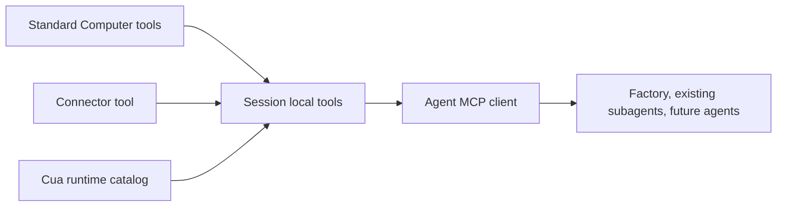

# Intent of the change

Restore Cua Driver tools to this fork's authored agents after upstream reconciliation replaced their local-tool assembly with connector and inference wiring that omitted Cua.

# Architecture changes

No shared runtime contract changes. Fork-owned agent entrypoints now build one session-bound local tool set containing standard Computer tools, connector configuration, and every tool returned by the Cua runtime catalog before constructing the agent MCP client.

# Summarized package changes

- `configuration/agent/`: factory and pirate-poet again load and expose the complete Cua catalog while retaining connector and inference behavior.
- `configuration/templates/agent/`: future agents receive the same merged local-tool assembly.
- Agent instructions identify Cua Driver tools as direct local tools, not dynamic-registry tools.

# Critical to apply to forks

yes

Forks with authored agent entrypoints must preserve the asynchronous `createCuaTools` merge when reconciling newer connector or inference templates. Update every existing agent and the future-agent template together, then typecheck the rendered agent service.
