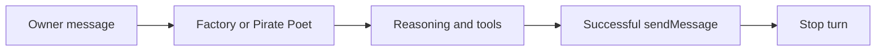

# Production agent scope and loop termination

## Intent of the change

- Keep production authored surface small: Factory plus Pirate Poet only.
- Remove Ello and Tassa2 source. Normal reconciliation then deprovisions their Tilde bundles.
- Stop a turn after first successful persisted `sendMessage`. Prevent duplicate visible answers.
- Keep 20-step ceiling as failure guard.

## Architecture changes

- No provider, protocol, auth, state, or deployment topology change.
- Agent-count change is fork-owned repository configuration.
- Generic stop condition lives in shared fork configuration and future-agent template.
- Failed `sendMessage` does not stop the loop. Discovery and other tools do not stop it.

## Summarized package changes

- `configuration/agent`: Factory adopts successful-message stop condition.
- `configuration/agent/subagents/pirate-poet`: Pirate Poet adopts same condition.
- `configuration/agent/subagents/ello`: removed.
- `configuration/agent/subagents/tassa2`: removed.
- `configuration/lib`: adds tested stop condition beside existing step preparation.
- `configuration/templates/agent`: newly created agents inherit the behavior.
- Workspace fixed release group receives a patch Changeset.

Validation:

- `pnpm --filter openbot test -- configuration/lib/agent-loop.test.ts`
- `pnpm check`
- `pnpm build`
- Live exe.dev proof: one simple Factory turn produced exactly one persisted `sendMessage`.

## Critical to apply to forks

yes — forks that want the same production scope must remove authored Ello and Tassa2 directories so reconciliation can deprovision them. Customized agents should adopt `stopAfterChatKitMessage` only when `sendMessage` is their terminal user-visible delivery tool. No secret, database, or state import is required.
