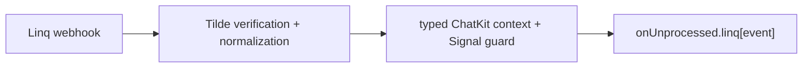

# Linq ChatKit SDK types

## Intent of the change

Give authored agents strong TypeScript contracts for Linq inbound ChatKit messages and normalized Signals. Stop making Linq consumers manually inspect provider metadata and raw Signal JSON.

## Architecture changes

The SDK follows the existing provider-aware conversion seam. Tilde still owns webhook verification and normalization. The Node SDK validates the delivered shape, narrows the provider/event type, then calls the author's event-specific handler.

## Summarized package changes

- `@trytilde/sdk-vercel-ai-node` exports `LinqChatKitMessageMetadata` and related chat, handle, message, and part types.
- `ChatKitEndpointContext.linq` contains validated metadata for `chatkit.channel.linq` messages.
- `LinqSignalType` covers every Linq event currently advertised by the companion Tilde provider.
- `LinqSignalByType`, `LinqWebhookEnvelope`, and event-family data types narrow handler input.
- `convertToAiSdkMessage(s)` dispatches registered Linq handlers through `onUnprocessed.linq` and retains the generic Signal fallback for unknown or malformed data.
- Focused context/dispatch tests, package documentation, and a minor Changeset are included.
- The branch is rebased onto the AgentMail SDK release. AgentMail and Linq metadata parsers,
  endpoint context fields, Signal maps, handlers, exports, tests, and README documentation coexist;
  neither provider replaces the other at the shared SDK seams.

## Critical to apply to forks

yes — forks that consume Linq messages should update `@trytilde/sdk-vercel-ai-node` after release and replace ad hoc JSON parsing with `context.linq` and `onUnprocessed.linq`. Merge/deploy the companion Tilde API Linq provider first so the metadata and Signal envelopes exist upstream. No configuration, secret, environment, or client migration is required.
