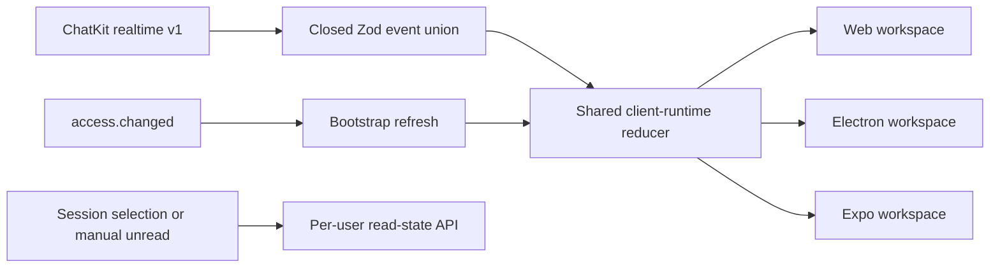

# PR 101: Adopt versioned ChatKit realtime events

## Intent of the change

- Consume the explicit ChatKit realtime event union delivered by
  `trytilde/api#175` across web, Electron, and Expo clients.
- Reconcile agent metadata/access, shared-session read state, messages, queue
  operations, turns, activity, tasks, and access invalidations without
  recursive payload searches or event-name substring inference.
- Remove the legacy workspace protocol and route vocabulary as a deliberate
  hard cutover.

## Architecture changes

- `packages/client-runtime` validates tagged socket frames and exact external
  event variants before applying them to shared state.
- Agent/session projections now carry metadata, authorization, ownership, and
  avatar information. Session user-state events update unread state for only
  the authenticated user.
- Queue item enqueue/update/remove/dequeue and turn/activity lifecycle events
  update deterministic runtime state by stable identifiers.
- `access.changed` schedules an authoritative workspace bootstrap refresh.
- The control service proxies only ticket and realtime URLs; all client
  platforms share the same reducer and native/browser transport selection.
- One-session SSE remains a separate typed transport for the selected
  conversation and is not conflated with workspace realtime.

## Summarized package changes

- `@tryopenbot/client-runtime`
  - Add the strict ChatKit event/frame schemas, direct reducers, access refresh,
    read-state mutation, queue reconciliation, and regression coverage.
- Control service
  - Use the renamed ChatKit realtime ticket and socket routes and update its
    route tests/documentation.
- Web, desktop, and Expo
  - Adopt the renamed workspace transport and shared read-state/realtime
    behavior; root builds verify mobile exports and desktop consumers.
- `@trytilde/api-client` and `@trytilde/sdk`
  - Refresh generated clients from API #175; 627 operations validate and all
    five generated SDK packages build/test.
- Agent provider, examples, docs, ADR-0014, and browser mocks
  - Remove the old vocabulary and align examples/tests with the new event
    lifecycle.
- `.changeset/replace-chatkit-realtime-contract.md`
  - Records the owner-visible fixed-package-group release.

Validation completed:

- `pnpm check`: passed with zero errors and 40 existing warnings;
- `pnpm build`: passed, including package verification and Android/iOS Expo
  exports;
- client runtime: 84 passed;
- control service: 63 passed; and
- full Playwright suite: 15 passed, 1 intentionally skipped.

## Critical to apply to forks

yes

Merge `trytilde/common-js#20` first, then deploy `trytilde/api#175` and this
OpenBot update together. The socket change is intentionally incompatible in
both directions, so mixed old/new API and OpenBot deployments are unsupported.
Run the API's additive per-user read-state migration before enabling the new
client. No OpenBot secret, environment, fork configuration, portable state, or
resource-identity migration is required. `configuration/` remains fork-owned;
the upstream PR contains only its canonical ignore-all sentinel.
