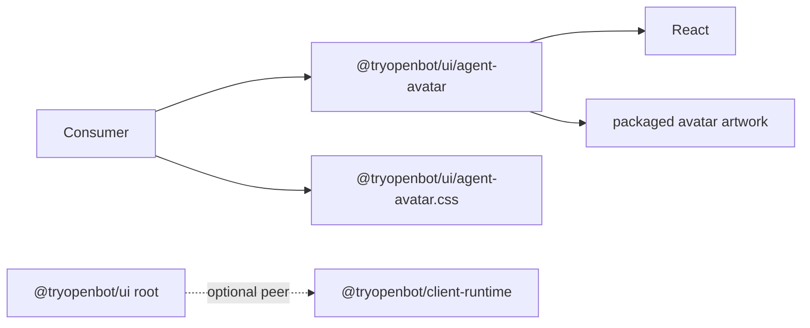

# Intent of the change

- Make real `AgentAvatar` reusable without whole OpenBot UI barrel.
- Keep avatar appearance. Avoid global OpenBot theme and token leakage.
- Remove required packed `client-runtime` workspace dependency from avatar consumers.

# Architecture changes

- New public avatar subpath points only at packed `dist` JavaScript and declarations.
- New stylesheet is component-scoped. It defines avatar layout and opacity transition only. It defines no theme tokens.
- `@tryopenbot/client-runtime` becomes optional peer plus workspace development dependency. Full UI consumers needing runtime-backed exports still install it. Standalone avatar consumers do not.
- No provider, protocol, state, configuration, deployment, authentication, or authorization boundary changes.
- ADR review found no new durable decision. Existing UI package owns this public interface.

# Summarized package changes

- `@tryopenbot/ui`
  - exports `./agent-avatar` and `./agent-avatar.css`;
  - packages scoped avatar CSS;
  - documents standalone consumer imports;
  - tests export targets and optional-peer contract.
- Fixed Changesets group receives a minor release note.
- Lockfile records client-runtime as optional UI peer.
- Validation passed: UI 66 tests, UI build, clean packed-consumer smoke, repository check, and repository build including web, mobile, desktop, package artifacts, and CLI verification.
- Packed-consumer smoke rendered `AgentAvatar`, resolved scoped CSS, and proved `client-runtime` absent.
- Configuration tree unchanged. Upstream sentinel remains sole tracked configuration file.

# Critical to apply to forks

yes — forks or downstream apps wanting only the avatar should pin a release or immutable Git commit containing this change, import `AgentAvatar` from `@tryopenbot/ui/agent-avatar`, and import `@tryopenbot/ui/agent-avatar.css`. Do not import `openbot-ui.css` only for the avatar. Full root-package consumers using runtime-backed UI exports must keep `@tryopenbot/client-runtime` installed explicitly.
