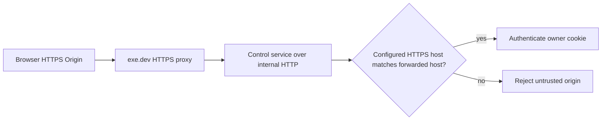

# Intent of the change

- Fix cookie-authenticated POST requests through a remote HTTPS development proxy.
- Keep CSRF origin validation strict: configured origin must use HTTPS and its hostname must exactly match the forwarded request host.
- Preserve localhost Vite development and Origin-free bearer authentication for native clients.
- Production symptom fixed: Mission Control socket tickets and other unsafe control endpoints no longer fail with `Untrusted request origin` solely because exe.dev terminates HTTPS before forwarding HTTP internally.

# Architecture changes

No ownership boundary changes. The control service now uses the same already-established public-origin resolver for both OAuth callbacks and cookie mutation validation.

# Summarized package changes

- `@tryopenbot/control-service`: compare unsafe browser requests against the host-matched configured HTTPS development origin before localhost discovery or internal request-origin fallback.
- Regression coverage proves the matching exe.dev origin proceeds while a foreign origin remains rejected.
- Unified patch Changeset added for the fixed workspace release group.
- Production proof on `our-openbot.exe.xyz`: matching public origin reaches the authentication boundary, foreign origin returns 403, and root/health remain 200.

# Critical to apply

yes — forks running `pnpm dev` behind exe.dev or another HTTPS-to-HTTP development proxy must update and redeploy the control service. Keep `PUBLIC_ORIGIN` set to the exact HTTPS owner origin; do not add wildcard or attacker-controlled origins. Localhost-only, Vercel production, and native bearer clients require no configuration migration.
