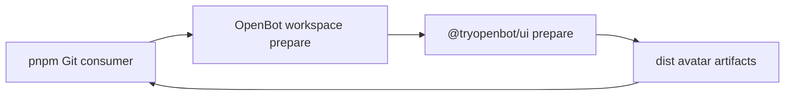

# Intent of the change

- Make `@tryopenbot/ui` usable as a pnpm Git dependency from a clean consumer.
- Ensure public built subpaths such as `@tryopenbot/ui/agent-avatar` exist before pnpm packs the selected workspace package.
- Prevent the production-only failure where a warm local package store hid missing Git artifacts.

# Architecture changes

No ownership boundary changes. The UI package still owns its public artifacts; its existing build now runs for both npm publication and Git dependency preparation.

# Summarized package changes

- `@tryopenbot/ui` runs its existing build from `prepare`, in addition to `prepack`.
- The avatar packaging test fixes the Git-install lifecycle as part of the public subpath contract.
- A clean external pnpm consumer installed the pushed Git commit, found the avatar JavaScript, declarations, and scoped CSS, and imported `AgentAvatar` successfully.
- The OpenBot fixed package group receives a patch changeset.
- Repository checks and builds pass. Existing non-blocking lint warnings remain unrelated.

# Critical to apply to forks

yes — forks or applications that pin `@tryopenbot/ui` directly from Git must update their immutable OpenBot commit to include this change. Keep `@tryopenbot/workspace` and `@tryopenbot/ui` allowed in pnpm build policy so the trusted Git dependency may generate and pack its artifacts. No state, secret, API, provider, or configuration migration is required.
