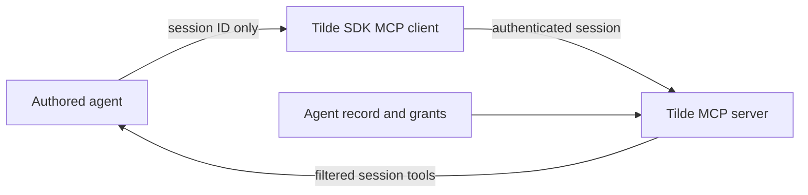

# Intent of the change

Keep ChatKit session scope as trusted context while removing the SDK option that let a caller
declare which agents or multiplayer sessions it wanted to reach. The server already owns those
grants. One agent must therefore have one consistent reach policy regardless of which process uses
its API key.

# Architecture changes

`ChatKitConnectionOptions` keeps the session ID and trusted session-bound tools. It no longer
contains a permissions declaration, and the client no longer emits the corresponding header.
Custom transport headers cannot override the typed session ID. No provider, deployment, database,
secret, or client-rendering boundary changes.

# Summarized package changes

- `@trytilde/sdk-vercel-ai-node` removes `ChatKitSessionPermissions` and
  `chatkit.permissions` from its public API.
- MCP connections still carry the validated ChatKit session and retain current local-tool and
  session-bound-tool behavior.
- Focused tests prove that only the session is sent and arbitrary headers cannot replace it.
- The package README and Changeset describe the final caller obligation.

# Critical to apply to forks

yes — remove any `chatkit.permissions` value passed to `createMCPClient`. Configure delegation and
session reach on the agent in Tilde instead. Keep `chatkit.sessionId`, `agentId`, local tools, and
trusted `boundTools` unchanged.
