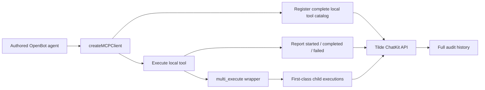

# Intent of the change

The Tilde SDK now lives in the OpenBot packages monorepo under ADR-0030. This change exposes the
ChatKit observability API added by [trytilde/api#188](https://github.com/trytilde/api/pull/188) and
uses it for locally bound MCP tools.

Every local tool execution is registered and reported to ChatKit. Dynamic multi-execute children
are first-class executions with parent and batch correlation, so audit history does not collapse
them into the wrapper call. Remote MCP execution remains owned by Tilde and is not double-reported.

# Architecture changes

No ownership boundary changes. Tilde API remains the observability control plane and persistence
owner. OpenBot's public SDK packages translate authored local-tool activity into that API.

The SDK core owns stable request wrappers and TypeScript types. The Vercel AI SDK adapter owns
registration and execution instrumentation for local tools. Generated API types remain generated
from Tilde's OpenAPI document.

# Summarized package changes

- `@trytilde/api-client`
  - Refreshes the generated client from the observability API contract.
  - Validates the new tool-registration and execution-reporting operations.
- `@trytilde/sdk`
  - Adds `ChatKitClient.registerAgentTools` and `ChatKitClient.reportToolExecution`.
  - Adds local multi-execute observation with stable execution, parent, and batch identifiers.
  - Reports wrapper and child completion or failure without losing the original tool error.
- `@trytilde/sdk-vercel-ai-node`
  - Requires an agent ID when local tools are configured.
  - Registers the complete local tool catalog when the MCP client connects.
  - Reports local started, completed, and failed states to ChatKit.
  - Closes the remote MCP client if local catalog registration fails.
- OpenBot agent template
  - Passes the authored agent ID and ChatKit session ID into `createMCPClient`.
- Documentation and release metadata
  - Documents the new adapter inputs and behavior.
  - Adds a Changeset for all affected published packages and the fixed OpenBot package group.
  - Uses stable generated-source provenance instead of a machine-local filesystem path.

Validation completed:

- `pnpm openbot sdk refresh` passed: 632 operations validated; all five SDK packages built; 158
  focused tests passed.
- `pnpm openbot sdk validate` passed.
- Focused SDK checks and tests passed with existing warnings only.
- Repository `pnpm build` passed, including web and Expo exports.
- Repository checks excluding the pre-existing untracked `reference/` directory passed with zero
  errors. The unfiltered formatting gate only reports files in that unrelated directory.

No client UI, protobuf, dependency, credential, secret, or persisted OpenBot configuration changes.
Live Tilde SDK E2E was not run because the required team, API key, and agent ID are unavailable.

# Critical to apply to forks

yes — forks with customized agent templates that bind local tools through `createMCPClient` must
pass `agentId` and should pass the current ChatKit `sessionId`. Rebase or refresh the future-agent
template before creating more agents. Existing callers without local tools require no change.

Deploy [trytilde/api#188](https://github.com/trytilde/api/pull/188) before releasing or using these
SDK changes. No environment or data migration is required for normal runtime use.
