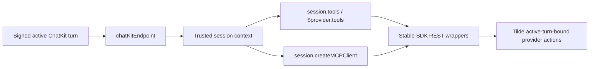

# Intent of the change

- Ship the Tilde SDK side of API PR 191 from its new home in OpenBot.
- Let endpoint authors choose direct agent-loop replies or tool-only visible replies.
- Give models useful provider actions without giving them session, participant, trigger-message, thread, repository, issue, or recipient routing authority.

# Architecture changes

The public SDK now turns trusted headers from one signed ChatKit invocation into provider-aware Vercel AI SDK tools. Tool mode prepends a private-reasoning instruction and exposes the same bound tools through direct endpoint context and an MCP client. Core SDK wrappers map stable camelCase inputs to the merged ChatKit REST operations. MCP treats these provider tools as server-bound capabilities, not authored local tools, so it does not register or report them a second time.

# Summarized package changes

- `@trytilde/api-client` refreshes generated OpenAPI contracts from merged API PR 191 and validates both session-tool operations as required SDK surface.
- `@trytilde/sdk` adds `sendSessionMessage` and `invokeSessionProviderTool` wrappers, stable request/result types, request mapping tests, and public README documentation.
- `@trytilde/sdk-vercel-ai-node` requires `responseMode`, injects private tool-mode instructions, supplies Slack/GitHub/Linq/AgentMail tool catalogs, carries the active trigger message outside model input, and exposes those tools through endpoint context and MCP.
- Session-bound MCP tools remain separate from authored local tools. They do not require `agentId`, do not enter authored-tool registration, and do not duplicate canonical execution reporting already owned by the ChatKit API.
- The Next.js SDK example selects `agentLoop` explicitly. No web, mobile, desktop, protobuf, provider lifecycle, environment, deployment, secret, or fork configuration behavior changes.
- `.changeset/add-chatkit-session-provider-tools.md` requests minor releases for the three affected public SDK packages.

# Critical to apply to forks

yes — forks that implement ChatKit endpoints must update `@trytilde/sdk`, `@trytilde/api-client`, and `@trytilde/sdk-vercel-ai-node` together, then add explicit `responseMode: "agentLoop"` for existing direct-response endpoints or `responseMode: "tool"` for provider-bound visible replies. Tool-mode MCP callers must create the client through `context.session.createMCPClient(...)` so the active-turn routing remains trusted and model-hidden. No environment, secret, database, provider, or client migration is required.
