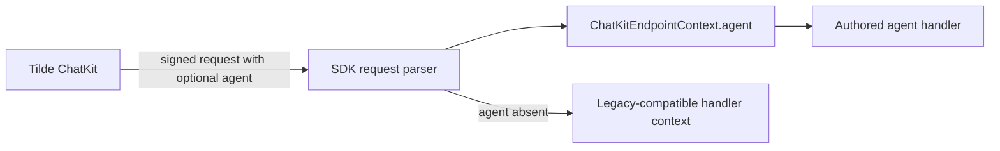

# Intent of the change

Tilde knows which registered agent receives each ChatKit turn, but authored
HTTP endpoints previously received only messages, session provenance, actor
headers, and provider metadata. Applications therefore had to hardcode their
own name/avatar or perform another lookup.

Expose the signed request's optional canonical agent snapshot through
`ChatKitEndpointContext.agent`. The SDK validates and types the agent ID,
display name, provider, status, principal, authenticated avatar path, and
lifecycle timestamps. Requests from older Tilde deployments remain valid and
produce no `context.agent`.

# Architecture changes

- `@trytilde/sdk-vercel-ai-node` owns runtime validation at the signed webhook
  boundary and exports the matching public TypeScript contract.
- The SDK forwards the validated snapshot both as `context.body.agent` and the
  convenient `context.agent` property.
- The avatar remains an authenticated Tilde API path. The request carries no
  avatar bytes, API key, webhook key, or other credential material.
- Strict invalid-agent coverage rejects malformed signed inputs before the
  authored handler runs; absence remains explicitly covered for mixed-version
  rollout.
- Package documentation and the minor Changeset describe the new public API.

Evidence reviewed for this record includes the complete branch diff, commit,
current goal requirements, validation output, and PR discussion. This runtime
did not expose a supported cross-task thread API, so unrelated local task
threads were not inspected or copied.

# Summarized package changes

- `@trytilde/sdk-vercel-ai-node`
  - Add `ChatKitRequestAgent` and `ChatKitRequestAgentAvatar`.
  - Parse the optional signed request field with `parseChatKitRequestAgent`.
  - Expose the snapshot through `ChatKitEndpointContext.agent`.
  - Preserve requests that omit the field and reject invalid status/shape.
  - Document the public context and add focused webhook tests.
- Release metadata
  - Add `.changeset/add-chatkit-agent-context.md` for a minor SDK release.

Checks on the implementation head:

- `pnpm install --frozen-lockfile`
- `pnpm --filter @trytilde/sdk-vercel-ai-node test` — 4 files, 86 tests
- `pnpm --filter @trytilde/sdk-vercel-ai-node check` — existing warnings only
- `pnpm --filter @trytilde/sdk-vercel-ai-node build`
- `pnpm check` — existing warnings only
- `pnpm build` — all package and client artifacts
- `git diff --check`

# Critical to apply to forks

no

This is an additive, optional signed-request field. Forks do not need a state,
configuration, environment, provider, route, or secret migration. Deploy the
matching Tilde API producer to populate `context.agent`; either deployment
order is safe because the SDK accepts requests without it. Agent code may then
replace hardcoded self-profile values with `context.agent` when useful.
