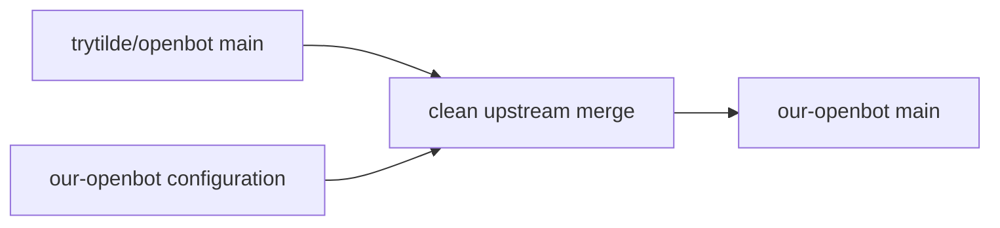

# Sync upstream mobile web and search polish

## Intent of the change

- Bring upstream OpenBot PR 113 into `our-openbot`.
- Preserve fork-owned Factory/Pirate configuration and deployment behavior.
- Ship narrow-viewport navigation, settings, dialogs, composer, and typed search improvements.

## Architecture changes

- Clean merge. No fork configuration conflict or compatibility adapter.
- Upstream ADR-0023 update becomes the governing responsive presentation rule.
- Imported upstream update record `docs/updates/113.md` remains provenance for the source change.

## Summarized package changes

- Imports upstream web, UI, E2E, Changeset, ADR, and update-record changes from PR 113.
- Leaves Factory, Pirate Poet, exe.dev providers, Code Storage, SOPS, and local runtime composition intact.
- Validation passed: frozen install, `pnpm openbot check`, `pnpm check`, and `pnpm build`.

## Critical to apply to forks

no — this is itself the fork update. No environment, secret, state import, provider migration, or dependency action is required. Deploy the resulting fork revision through the normal production workflow.
