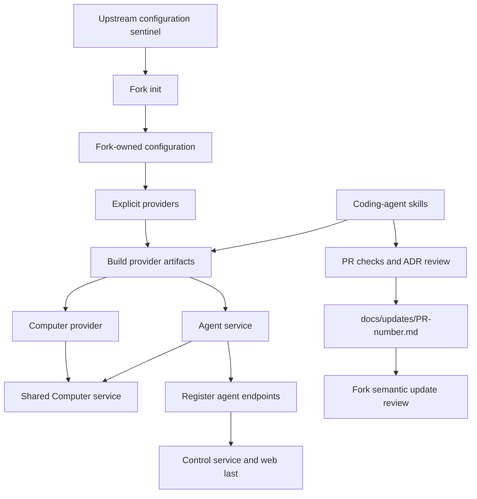

# OpenBot architecture rebuild and coding workflows

## Intent of the change

- Reset OpenBot from owner UX down. Remove legacy server/provider maze.
- Keep provider contracts internal TypeScript. RPC only for real service boundaries.
- Make fork own configuration, agents, tools, skills, secrets, and deployment choices.
- Make dev, local production, and Vercel production use the same provider lifecycles.
- Split agent service from control service. Agent edits avoid control rebuild.
- Make Computer tools explicit, typed, Zod-backed, and agent-bound.
- Keep upstream configuration empty. Let fork init expose and scaffold it.
- Give coding agents durable provider, agent, ADR, PR, and fork-update rules.
- Collapse old stacked PRs into this one complete main-bound change.

## Architecture changes

- `apps/control-service`: bare Hono control/web boundary. Owner proto empty for now.
- `apps/computer-service`: one API-key-protected internal typed Computer API.
- `packages/*-provider`: contract in `core.ts` or `core/index.ts`; implementation beside contract. No separate core packages.
- `packages/runtime-provider`: build/deploy coordinator. Build first. Runtime last.
- `packages/control-service-provider`: local and Vercel control/web artifacts.
- `packages/agent-service-provider`: local combined agent server; parallel independent Vercel functions.
- `packages/computer-provider`: Microsandbox/Vercel Sandbox, shared image, typed agent tools, workspace seed.
- `packages/configuration`: explicit seven-provider composition. Runtime-safe provider subset separate.
- `cli`: Ink + arg commands for init, dev, new-agent, secrets, and build/deploy lifecycle.
- `configuration/`: upstream tracks only ignore-all `.gitignore`. Successful fork init removes exact sentinel after scaffolding.
- Desktop stays client. Never starts control service.
- Root env and root SOPS forbidden. Fork values only under `configuration/`.
- `.agents/skills`: coding workflows enforce current architecture, agent layout, provider ownership, validation, and PR delivery.
- `.github/pull_request_template.md`: human PR workflow matches create-PR skill gates.
- `docs/updates/<pr-number>.md`: one continuously refreshed fork-update record per upstream PR.

## Summarized package changes

- `@openbot/agent-provider`: agent/session/message boundary; Tilde Harness SDK adapter; prompt/tool hooks.
- `@openbot/agent-service-provider`: discover Eve-shaped agents; instrumentation ordering; local server; parallel Vercel functions; registration inputs.
- `@openbot/computer-provider`: singular package; OCI image build/deploy; Microsandbox and Vercel implementations; shell, await, file, copy, glob, grep, screenshot tools.
- `@openbot/computer-service-proto`: internal lifecycle, execution, file, desktop, ports, VNC transport, background jobs, and await.
- `@openbot/configuration`: all seven roles mandatory; `RuntimeProviders` keeps deployment compilers out of agent bundles.
- `@openbot/control-service-proto`: intentionally empty owner contract.
- `@openbot/control-service-provider`: provider-owned Handlebars assets; local systemd/launchd; Vercel Build Output API.
- `@openbot/inference-model-provider`: explicit OpenAI API-key and OAuth constructors.
- `@openbot/runtime-provider`: optional `Buildable` and `Deployable`; secret classes; sandbox aggregation; runtime-last ordering.
- `@openbot/skills-provider`: core skill boundary and Tilde implementation.
- `@openbot/tools-provider`: Vercel AI SDK tools and Tilde implementation.
- `@openbot/utilities`: strict Handlebars file templates.
- `@openbot/cli`: SOPS identities, provider setup, agent scaffolding, dev supervisor, selective deployment, and safe sentinel removal.
- Init refuses custom fork-owned `configuration/.gitignore`; stops before writing `.env`.
- Removed legacy server, Box API, providers/provider-sdk, database/contracts, root Vercel files, setup code, and global configuration skills/sandbox.
- `.agents/skills/create-or-update-agent`: fixed Eve-compatible tree, Zod Computer tools, instrumentation, instructions, libraries, skills, workspace seed, and `openbot new-agent`.
- `.agents/skills/implement-provider`: provider-local core contracts, Handlebars assets, optional build/deploy lifecycle, prompt/tool hooks, and adapter tests.
- `.agents/skills/create-pr`: README/public API gate, provider core placement, configuration ownership, ADR review, PR-number update records, all-thread evidence review, and requested skip marker.
- Other coding-agent skills use current package names, paths, contracts, and deployment commands.
- GitHub PR template covers repository context, checks, state, security, configuration ownership, ADRs, package docs, changesets, update record, frontend evidence, limitations, and final review.
- ADR-0013 owns repository bootstrap, PR-number update records, safe fork merging, and future coding-agent update launch.
- Update generation opened all 391 locally indexed coding-agent rollout files and analyzed 80,678 readable user/assistant messages. Thirty malformed JSONL lines could not be parsed; no raw or unrelated thread content copied.

## Critical to apply to forks

yes

- Move provider imports to consolidated owning packages. Old core/provider SDK imports fail.
- Rename Box/server terminology to Computer/control service.
- Preserve fork `configuration/`. Never restore upstream sentinel in initialized fork.
- New fork runs init, then commits generated configuration and sentinel deletion. Ordinary upstream merges preserve committed deletion while sentinel unchanged.
- Recreate explicit seven-provider composition and runtime-provider subset through init or manual migration.
- Move agent skills and workspace seeds under `configuration/agents/<id>/`.
- Use explicit generated Computer tool files and typed computer-service calls.
- Move secrets/env from repository root into `configuration/.env` and `configuration/secrets.enc.yaml`; `.env` stays ignored.
- Review deployment topology: agent service, Computer, agent registration, development sandbox, control runtime.
- Verify desktop points at separately run or deployed control service.
- Merge coding-agent skill and PR template changes. Otherwise later automated edits may recreate removed architecture.
- Replace hash-addressed update automation with `docs/updates/<pr-number>.md`.
- Open draft PR before update generation. Refresh same record after every implementation or review change.
- Permit read-only local coding-agent thread inspection for update generation. Never commit raw transcripts, unrelated conversation, credentials, secrets, or personal data.
- For `trytilde/dispatch` contributions, track only canonical configuration sentinel. For fork PRs, track initialized configuration and exclude `.env`.
- Read ADR-0001 and ADR-0004 through ADR-0013 before conflict resolution. The Vite+ toolchain record in that range was later renumbered to ADR-0026.
- Run `pnpm check`, `pnpm build`, focused CLI/provider tests, and fork-critical behavior tests.
