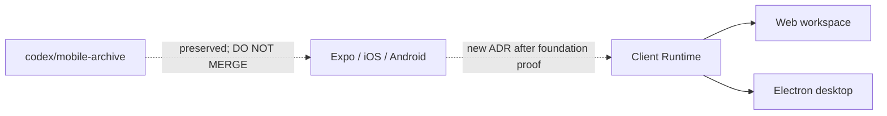

# Intent of the change

- Pause native mobile. Main serves web workspace plus Electron desktop only.
- Remove stale product promise. Expo client existed, but foundation still changing: auth, ChatKit, tools, Computer, deployment, upgrades.
- Remove build burden. Normal install/check/build no longer resolves Expo, React Native, Android, iOS, Metro, EAS, adb, emulator stack.
- Preserve work. `codex/mobile-archive` points at complete pre-removal tree. After this PR merges, open archive against new main. Label **DO NOT MERGE**. Never merge archive as-is.
- Make return explicit. New ADR required after foundation has deployed proof. Refresh dependencies and product scope then; do not blindly revive stale native code.

# Architecture changes

- Delete `apps/mobile` renderer and native configuration.
- Delete `openbot mobile` CLI group: doctor, setup, Expo run, Android emulator, screenshots, logs, release.
- Delete mobile remote-host transport: Metro, adb, emulator VNC, mobile task dispatch.
- Keep remote Electron desktop task and tunnel.
- Delete mobile publication workflow and EAS/App Store/Play Store machinery.
- Delete vendored Expo/EAS coding skills and their lock entries. Active skill catalog now describes code present on main.
- Keep Client Runtime framework-neutral. Active consumers: browser web and Electron renderer.
- Keep responsive-web mobile viewport tests. They test narrow browser layout, not native mobile.
- Record durable pause in ADR-0033. Historical ADRs keep history and point to superseding decision.

# Summarized package changes

- `apps/mobile`: removed complete Expo/React Native application, native auth adapter, ChatKit renderer, connector setup, Computer screen, BNA UI source, themes, navigation, onboarding, assets, app config, Metro config, and EAS config.
- `openbot` CLI: removed `mobile` commands, Android SDK/NDK discovery, platform doctor, emulator and Expo orchestration, mobile release, mobile workspace discovery, Metro/adb tunnels, and mobile remote tasks. `connect` and `remote` now serve Electron desktop only.
- `@tryopenbot/desktop`: removes mobile deep-link branches and keeps Electron-specific behavior.
- `@tryopenbot/client-runtime`: no wire/state behavior change. Documentation and presentation contracts stop claiming an active Expo consumer.
- `@tryopenbot/control-service` and `@tryopenbot/ui`: remove mobile OAuth-return wording and mobile-client discriminator branches.
- Root workspace: removes mobile scripts and package, trims lockfile by roughly 4,100 lines, and removes mobile release workflow.
- Repository guidance: removes Android/iOS/Expo prerequisites and commands from README, contributor guide, AGENTS, skills, provenance, and workflow ADRs.
- Release: fixed pre-1.0 package group receives a minor Changeset because public CLI commands and a supported client disappear.
- Rebase: merged OpenBot #109 remains baseline SDK behavior; removing the native
  renderer does not alter its server-side `context.agent` contract.

Validation completed:

- Frozen pnpm install: pass; 27 workspace projects.
- CLI tests: 32 files, 163 tests pass.
- Full `pnpm check`: pass.
- Full `pnpm build`: pass.
- Linux x64 Electron package: pass; AppImage produced.
- Changeset status and diff hygiene: pass.
- Active-tree scan: no Expo, React Native, Android, iOS, Metro, adb, emulator, mobile workspace, or mobile command references. Remaining `mobile viewport` strings are responsive-web E2E coverage.

# Critical to apply to forks

yes

Forks carrying mobile customizations must preserve them before updating. This update deletes the native application and all supported mobile workflows from main.

Fork action:

1. Create a preservation branch or tag before applying this update. Upstream reference is `codex/mobile-archive`.
2. Remove fork scripts that invoke `openbot mobile`, `dev:mobile*`, `release:mobile`, Metro, adb, emulator VNC, or `mobile-v*` releases.
3. Remove mobile-only fields from `configuration/dev-hosts.json`; Electron `desktopVncPort` remains supported.
4. Remove native secrets and EAS/store credentials from external secret managers when the fork no longer needs them. This PR contains and migrates no secret values.
5. Run frozen install, `pnpm check`, `pnpm build`, and Electron packaging after updating.
6. Do not merge the archive branch onto current main. If native mobile returns, make a new ADR, select current scope, refresh all dependencies, and port against current Client Runtime contracts.

No HTTP, ConnectRPC, Tilde resource, database, persisted control-state, or deployment checkpoint migration is required. Web and Electron runtime behavior remains supported.
