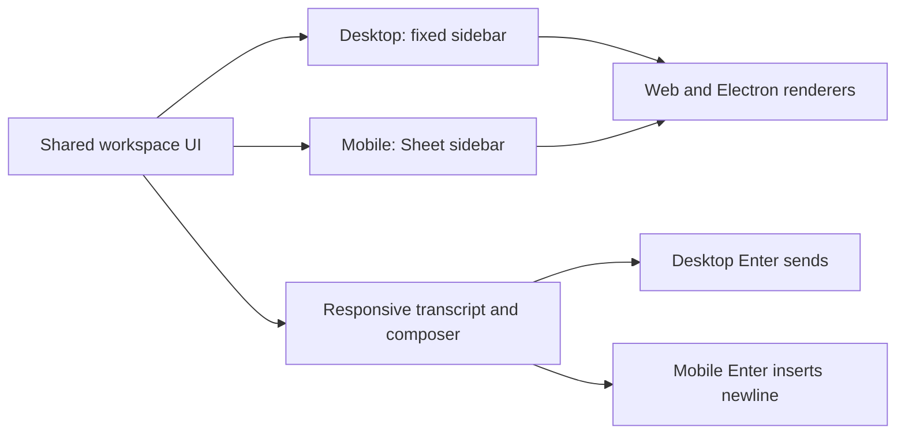

# Intent of the change

Make the shared OpenBot web workspace usable at phone widths. Navigation must remain reachable without consuming the whole viewport, the prompt composer must stay inside safe areas, and mobile keyboards must be able to insert newlines without accidentally sending.

# Architecture changes

Responsive state remains presentation-only. Web and Electron continue to render the same shared UI components and Client Runtime remains unchanged.

# Summarized package changes

- `@tryopenbot/web`: add the narrow-screen navigation trigger and responsive workspace shell composition.
- `@tryopenbot/ui`: add the Shadcn/Radix Sheet primitive, responsive sidebar, touch-visible controls, safe-area and overflow styling, and mobile-aware composer keyboard behavior.
- `@tryopenbot/ui`: add focused composer coverage and a 390px Playwright regression for navigation and prompt composition.
- Release metadata: add a fixed-group Changeset for the owner-visible responsive behavior.

# Critical to apply to forks

no — forks receive the responsive behavior through the normal OpenBot package update. There is no configuration, state, credential, API, provider, dependency, or deployment migration. Customized workspace/sidebar/composer markup should be regression-tested at a 390px viewport after updating.
