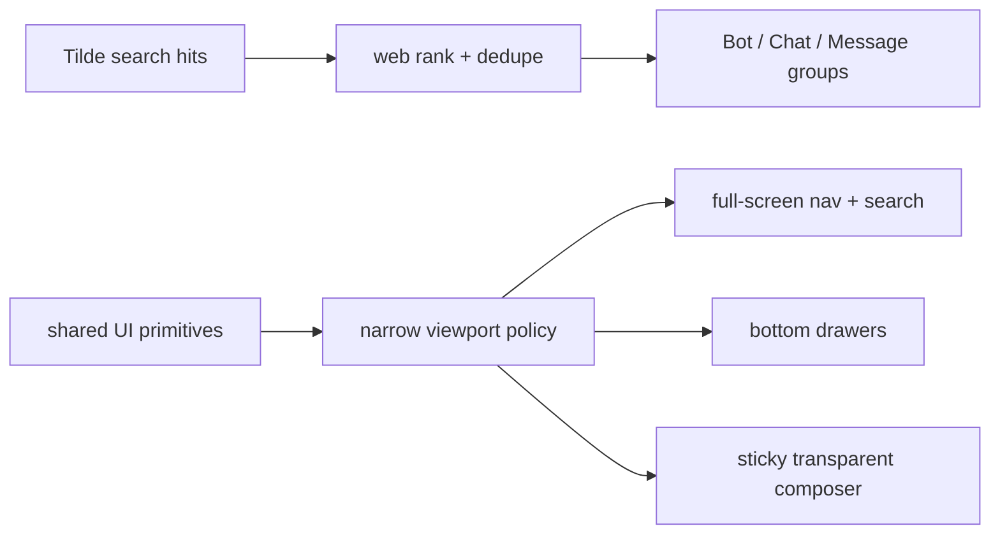

# Mobile web and workspace search polish

## Intent of the change

- Prevent mobile-browser zoom when focusing chat and search inputs.
- Keep chat composer pinned to visible bottom without an opaque parent strip.
- Make workspace navigation and search full-screen on narrow viewports.
- Make settings navigation a bottom drawer; keep catalog cards one column.
- Render Bot, Chat, and Message search hits distinctly. Deduplicate and rank exact bot matches first.
- Highlight the matching text.

## Architecture changes

- `apps/web` still owns data and routing. It ranks authoritative Tilde results before mapping UI props.
- `packages/ui` still owns presentation. Shared Dialog and Sheet primitives own responsive overlays.
- ADR-0023 records narrow-viewport overlay and composer policy.
- No new client-runtime wire contract. No app-local fetch or response type.

## Summarized package changes

- `apps/web`: adds deterministic result IDs, exact-name ranking, deduplication, mobile settings drawer.
- `packages/ui`: adds bottom Sheet support; responsive dialog behavior; full-screen mobile navigation/search;
  typed grouped results with match highlighting; sticky transparent 16-pixel composer.
- `tests/e2e`: proves full-screen navigation/search, settings drawer, non-zooming composer, typed result
  groups, one bot result, exact-first ranking, and match highlighting.
- Fixed workspace release group receives a patch Changeset.

Validation:

- Focused search unit tests: 6 passed.
- UI and web TypeScript checks passed.
- Focused Playwright browser run: 3 passed.
- `pnpm check` passed with existing warnings only.
- `pnpm build` passed with the existing large-chunk warning.

## Critical to apply to forks

no — no fork-owned configuration, environment, provider, protocol, secret, state, or dependency action is required. Forks receive the responsive presentation and search behavior through the normal upstream update. Custom UI overrides should be rechecked against ADR-0023's shared narrow-viewport policy.
