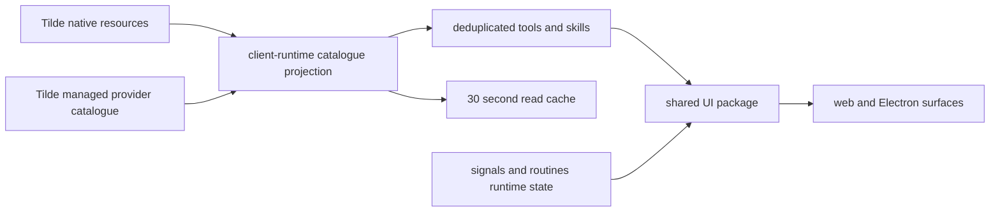

# Intent of the change

- Make mobile chat input compact. Keep it almost flush with safe-area bottom. Stop browser text zoom.
- Make mobile settings usable: responsive cards, wide content where needed, full routine management.
- Show one provider once. Stripe, AgentMail, and similar providers no longer split native account and managed setup into duplicate cards.
- Stop broken guessed icon requests. Resolve Tilde relative assets. Otherwise show local monogram.
- Reduce repeat settings reads with short cache. Invalidate after writes.
- Remove account email from account-menu heading when name and email are same.

# Architecture changes

- Client-runtime remains network and projection owner.
- UI remains presentation owner. It does not add a new OpenBot provider API.
- Native provider wins as setup surface. Managed connections merge into same provider entry.
- Tilde data remains authority. Cache is ephemeral and cleared by mutations.
- Routine provider cards and routine rows reuse existing signals/routines contracts and actions.
- Mobile positioning is CSS-only shared presentation behavior.

# Summarized package changes

- `@tryopenbot/client-runtime`
  - Adds `TildePluginsTransport` with optional dynamic API origin.
  - Resolves relative server icon paths.
  - Coalesces native and managed records.
  - Adds short catalogue caching and mutation invalidation.
  - Adds regression coverage for duplicate providers, relative icons, and cache reuse.
- `@tryopenbot/ui`
  - Adds `RoutineProvidersSettings` and `RoutineSettings` exports.
  - Renders responsive provider cards and searchable/filterable routine management.
  - Uses local fallback marks instead of arbitrary remote `default.svg` URLs.
  - Hides duplicate email account heading.
  - Tightens mobile composer geometry.
- `@tryopenbot/web`
  - Connects routine provider and routine management surfaces to shared runtime actions.
  - Uses the existing routine editor for create/edit/run/delete flows.
- Tests
  - Client-runtime: 95 pass.
  - UI: 70 pass.
  - Repository check and build pass.
  - Chromium verifies tools/routines and mobile composer geometry.

# Critical to apply to forks

yes

Forks should merge this update before expecting the corrected settings catalogue and new Routines page. No environment variable, secret, state import, database, protobuf, provider composition, or deployment-topology migration is required. Fork-owned configuration does not change. Rebuild the shared client runtime, UI, and web artifacts, then verify tool-provider cards and the routines route against the fork's configured Tilde API.
