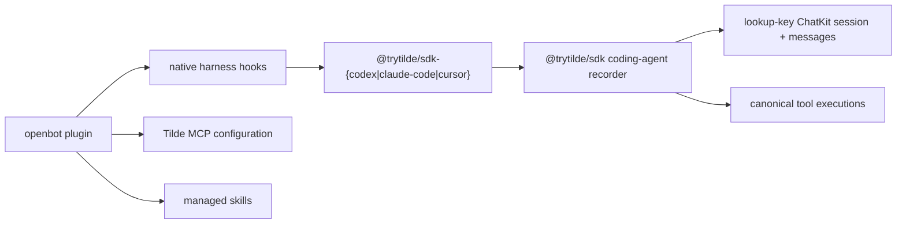

# Intent of the change

- Record Codex, Claude Code, and Cursor prompts, responses, and tools in canonical Tilde ChatKit audit storage.
- Keep Tilde MCP server and managed-skill setup in the existing `openbot plugin` workflow.
- Publish small harness-specific wire adapters without rebuilding storage behavior three times.

# Architecture changes

- `@trytilde/sdk` owns one normalized coding-agent event union and the ChatKit session/message/tool mapping.
- Each new adapter package owns only its harness's hook payload normalization.
- `openbot plugin` stores non-secret API URL, team ID, and agent ID routing. It reuses the existing API-key environment or mode-0600 OAuth token store.
- Codex receives a packaged plugin containing its hooks, a Tilde platform skill, and generated MCP declarations. Claude Code and Cursor receive their native user hook files.
- API types are regenerated from trytilde/api#213.

# Summarized package changes

- `@trytilde/sdk`: adds `recordCodingAgentEvent`, coding-agent identity helpers, idempotent agent-session creation, canonical message creation, and inline tool metadata reporting.
- `@trytilde/sdk-codex`: maps Codex hooks and ships the validated Codex plugin.
- `@trytilde/sdk-claude-code`: maps Claude Code session, prompt, tool, failure, stop, and end hooks.
- `@trytilde/sdk-cursor`: maps Cursor agent session, prompt, response, and generic tool hooks.
- `openbot`: discovers a visible ChatKit audit agent, installs hooks, persists non-secret routing, and exposes the fail-open hook subprocess command.
- SDK release scripts: validate, publish, pack, install, compile, and run all three new packages in a clean consumer.
- End-to-end proof: the three adapters wrote three searchable messages in three
  canonical ChatKit sessions; repeated Codex hooks reused one session and its
  tool lifecycle finished as one completed canonical execution.

# Critical to apply to forks

yes — merge and deploy trytilde/api#213 before releasing or consuming these adapters. Forks using `openbot plugin` should rerun it for each desired harness so native hooks and the selected ChatKit audit agent are installed. Existing MCP and skill configuration remains compatible. No fork-owned `configuration/`, environment, secret, provider, web, Electron, or Expo migration is required.
