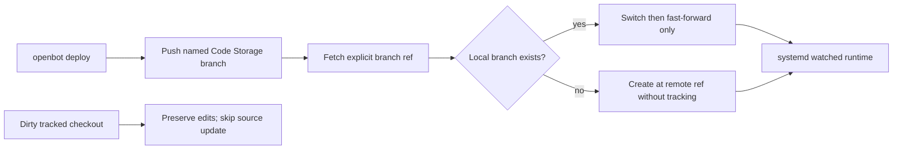

# Intent of the change

exe.dev deploy pushed requested Code Storage branch, but existing VM checkout stayed on prior branch. Then fast-forward merged requested remote branch into wrong local branch. Diverged history correctly failed deploy. Single-branch clone also rejected adding tracking metadata for newly fetched branch.

Make clean repeat deploy switch to exact requested branch safely. Keep dirty tracked remote edits untouched. Never force push or reset.

# Architecture changes

Provider boundary unchanged. `ExeDevRuntimeServiceProvider` still owns VM source reconciliation and service restart. Code Storage provider still owns repository credential and branch push.

# Summarized package changes

- `@tryopenbot/agent-service-provider`
  - Ignore untracked runtime files when deciding whether tracked source is dirty.
  - Fetch requested Code Storage branch with explicit local remote ref.
  - Switch existing requested branch before fast-forward.
  - Create missing branch at fetched ref with no upstream tracking dependency.
  - Test rendered reconcile script contains every safe branch step.
- Changesets
  - Patch fixed OpenBot package group.

Validation: provider 19 tests pass; provider build passes; full `pnpm check` and `pnpm build` pass. Real our-openbot deployment converged and public health, SPA, unsigned-agent rejection, and systemd service passed.

# Critical to apply to forks

yes

Forks using exe.dev must merge this before deploying a different named source branch to an existing VM checkout. No configuration, secret, state, dependency, or manual VM migration is required. Rerun ordinary `openbot deploy --yes`; the provider converges the clean checkout. If tracked VM edits exist, commit or intentionally remove them first because deploy continues preserving them.
