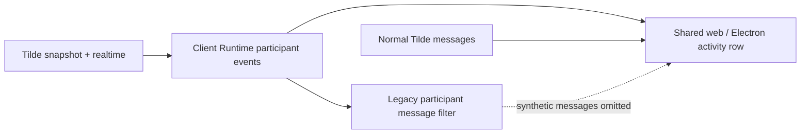

# Intent of the change

- Stop participant join/leave facts pretending to be chat messages.
- Show same facts as quiet session activity.
- Keep old transcripts clean by filtering legacy synthetic participant messages.
- Refresh Tilde generated SDK for current personal Memory source bindings, Wiki grep, and participant event contract.

# Architecture changes

- Client Runtime owns participant wire schema, snapshot state, realtime reconciliation, dedupe, and legacy-message filtering.
- Shared web owner surface only renders presentation. Electron uses same surface. No duplicate client state.
- Tilde remains source of truth. `participant_events` snapshot field optional during mixed-version rollout.
- Governing ADR-0014 updated. No new provider, route, control state, or deploy participant.

# Summarized package changes

- `@tryopenbot/client-runtime`: add participant identity/event contracts; hydrate and reconcile per-session participant activity; filter old `tilde.chatkit.participant` messages; add focused snapshot, realtime, and filtering tests.
- `@tryopenbot/web`: merge participant activity with message chronology and render simple joined/left rows.
- `@tryopenbot/ui`: add shared styling for quiet participant activity.
- `@trytilde/api-client` and `@trytilde/sdk`: regenerate from merged Tilde API, including participant activity, personal Memory source bindings, and Wiki grep.
- Docs: amend ADR-0014 and client-runtime README. Add two Changesets.
- Validation: frozen install; SDK refresh builds/tests; Client Runtime 96 tests; web 3 tests; repository check/build; browser e2e 16 passed and 1 skipped.

# Critical to apply to forks

yes — update after Tilde API PR #221 is deployed. Fork must consume refreshed generated SDK files and keep participant activity in Client Runtime. Fork-owned chat UI should render `conversation.participantEvents` separately from `conversation.messages`; old custom transcript code must also omit data parts whose `data_type` is `tilde.chatkit.participant`. No configuration, secret, environment, state import/export, or external dependency migration is required.
