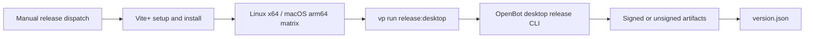

# Desktop release workflow runner correction

## Intent of the change

Desktop release workflow install Vite+. Later workflow steps call `pnpm` anyway. Fresh runner may not have that command. Build, publish, or final manifest can stop before OpenBot release command runs.

Change three workflow commands. Call root `release:desktop` task through `vp run`. Keep command arguments, release safety checks, signing secrets, AWS role, artifact paths, and manual dispatch unchanged.

## Architecture changes

No application architecture changes. No state or API changes. Existing ADR-0028 release boundary stays the same.

Before, the matrix crossed from Vite+ setup to a separate command executable. After, every release phase stays on the installed Vite+ task path.

## Summarized package changes

- Repository workflow: run desktop build through `vp run release:desktop`.
- Repository workflow: run artifact publication through the same task.
- Repository workflow: run `version.json` publication through the same task.
- OpenBot CLI: no source change.
- Desktop package: no source, version, artifact, signing, or update-feed change.
- Web and owner clients: no change.
- Dependencies and contributor prerequisites: no change.
- Changeset: none. This is CI-only.

Validation covers workflow YAML parsing and formatting, all CLI tests, the full repository check and build, and argument forwarding into the read-only release status command. The manually dispatched dry-run release workflow passed its plan, Linux x64 build, macOS arm64 build, and artifact-upload jobs without publishing.

## Critical to apply to forks

yes

Forks using the inherited desktop release workflow should merge this update. No configuration or secret migration is needed. Keep any fork-owned bucket and AWS role variables. After updating, manually dispatch a dry-run desktop release and confirm the selected Linux x64 or macOS arm64 job reaches the OpenBot release command.
